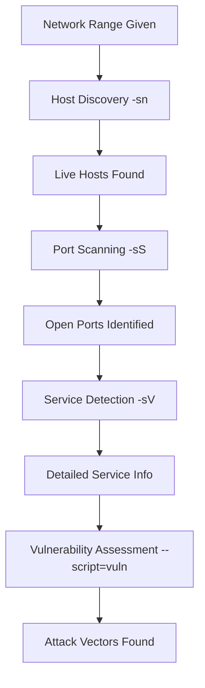

# 🛡️ Nmap - The Ultimate Network Discovery & Security Scanner

> **The most critical tool for any penetration tester** - Master this tool and you'll pass 40% of eJPT exam scenarios!

Nmap (Network Mapper) is the industry-standard network discovery and security auditing tool. It's your first weapon in any penetration test, capable of mapping entire networks, identifying services, and finding security vulnerabilities.

**Location:** `02-reconnaissance/nmap-comprehensive-guide.md`

---

## 🎯 What is Nmap? (Must-Know for eJPT)

**Nmap** is a powerful, open-source network scanner that uses raw IP packets to perform comprehensive network reconnaissance. Think of it as your **digital radar** - it reveals what's hiding in any network.

### 🔥 Core Capabilities (100% Exam Coverage):
- **🕵️ Host Discovery:** Find live systems on any network (IP ranges, subnets)
- **🚪 Port Scanning:** Identify open/closed/filtered ports (65,535 possibilities per host)  
- **🔍 Service Detection:** Determine exact service versions and protocols running
- **💻 OS Fingerprinting:** Identify target operating systems with high accuracy
- **🛡️ Vulnerability Scanning:** Use 600+ NSE scripts for security assessment
- **📊 Network Mapping:** Create complete network topology maps

### ⚡ Why Nmap is Essential for eJPT:
- **Used in 90%+ of eJPT exam scenarios**
- **Foundation tool** - other tools depend on Nmap results
- **Fastest way** to understand network architecture
- **Required for** service enumeration and exploitation planning

---

## 📦 Installation & Setup (Lab Environment)

### ✅ Prerequisites Checklist:
- [ ] Kali Linux VM (Nmap pre-installed)
- [ ] Administrative privileges (`sudo` access)
- [ ] Network connectivity to target lab environment
- [ ] Understanding of IP addressing and subnets

### 🔧 Installation Commands:
```bash
# ✅ Verify Nmap installation (Kali Linux)
nmap --version
# Expected Output: Nmap version 7.94 ( https://nmap.org )

# 📦 Install on Ubuntu/Debian (if needed)
sudo apt update && sudo apt install nmap

# 🔄 Update Nmap script database (IMPORTANT!)
sudo nmap --script-updatedb
# Expected Output: NSE script database updated successfully

# 🧪 Test basic functionality
nmap scanme.nmap.org
# Expected Output: Basic port scan results
```

### 🎛️ Initial Configuration:
```bash
# 📋 Check available NSE scripts
ls /usr/share/nmap/scripts/ | wc -l
# Expected Output: 600+ scripts

# 🔍 Find specific script categories
ls /usr/share/nmap/scripts/ | grep -E "(http|smb|ftp|ssh)"

# ⚙️ Create custom scan profiles directory
mkdir ~/nmap-profiles
cd ~/nmap-profiles
```

---

## 🚀 Basic Usage & Fundamental Concepts

### 📝 Essential Workflow (Follow This in Exams!):


### 🎯 Command Structure (Memorize This!):
```bash
# 📘 Basic Syntax Pattern
nmap [SCAN TYPE] [OPTIONS] [TARGET SPECIFICATION]

# 🔥 Most Common eJPT Commands (Practice Daily!)
nmap -sn 192.168.1.0/24           # Host discovery
nmap -sS -T4 192.168.1.10         # Stealth port scan
nmap -sV 192.168.1.10             # Service version detection
nmap -A 192.168.1.10              # Aggressive comprehensive scan
nmap -p- 192.168.1.10             # All ports scan
```

### ⏱️ Timing Templates (Critical for Exam Time Management):
```bash
-T0  # Paranoid (very slow, IDS evasion)
-T1  # Sneaky (slow, some IDS evasion)
-T2  # Polite (slower, less bandwidth)
-T3  # Normal (default timing)
-T4  # Aggressive (fast, common in labs)  ⭐ EXAM FAVORITE
-T5  # Insane (very fast, may miss results)
```

---

## ⚙️ Complete Command Reference (Exam Cheat Sheet)

### 🕵️ Host Discovery Options:
| Command | Purpose | eJPT Usage | Example |
|---------|---------|------------|---------|
| `nmap -sn` | **Ping scan only (no ports)** | 🔥 **Essential - Start every exam** | `nmap -sn 192.168.1.0/24` |
| `nmap -Pn` | **Skip ping (treat as online)** | 🚨 **When hosts don't respond to ping** | `nmap -Pn 192.168.1.10` |
| `nmap -PS80,443` | **TCP SYN ping to specific ports** | 🎯 **Web servers detection** | `nmap -PS80,443,8080 192.168.1.0/24` |
| `nmap -PA80,443` | **TCP ACK ping** | 🔒 **Bypass stateful firewalls** | `nmap -PA22,80,443 192.168.1.0/24` |
| `nmap -PU53,161` | **UDP ping** | 🌐 **DNS/SNMP services** | `nmap -PU53,161,123 192.168.1.0/24` |

### 🚪 Scan Techniques (Know All for eJPT):
| Command | Purpose | eJPT Importance | Stealth Level | Example |
|---------|---------|-----------------|---------------|---------|
| `nmap -sS` | **TCP SYN scan (half-open)** | ⭐⭐⭐⭐⭐ **Most used** | High | `nmap -sS -T4 192.168.1.10` |
| `nmap -sT` | **TCP Connect scan** | ⭐⭐⭐ **When not root** | Medium | `nmap -sT 192.168.1.10` |
| `nmap -sU` | **UDP scan** | ⭐⭐⭐⭐ **DNS, SNMP, DHCP** | Medium | `nmap -sU --top-ports 100 192.168.1.10` |
| `nmap -sA` | **TCP ACK scan** | ⭐⭐ **Firewall analysis** | High | `nmap -sA 192.168.1.10` |
| `nmap -sF` | **FIN scan** | ⭐⭐ **Stealth scanning** | Very High | `nmap -sF 192.168.1.10` |

### 🎯 Port Specification (Exam Time Savers):
| Command | Purpose | Time to Complete | eJPT Usage |
|---------|---------|------------------|------------|
| `nmap -p 80,443,22` | **Specific ports only** | ⚡ 5-10 seconds | 🔥 **Quick checks** |
| `nmap -p-` | **All ports (1-65535)** | ⏰ 10-30 minutes | 🎯 **Thorough analysis** |
| `nmap --top-ports 1000` | **Most common 1000 ports** | ⚡ 1-3 minutes | ⭐ **Balanced approach** |
| `nmap -F` | **Fast scan (top 100 ports)** | ⚡ 10-30 seconds | 🚀 **Initial reconnaissance** |
| `nmap -p 1-1000` | **Port range** | ⚡ 30-60 seconds | 📊 **Systematic scanning** |

### 🔍 Service & OS Detection:
| Command | Information Gathered | eJPT Value | Example |
|---------|---------------------|-------------|---------|
| `nmap -sV` | **Service versions** | ⭐⭐⭐⭐⭐ **Essential** | `nmap -sV 192.168.1.10` |
| `nmap -O` | **Operating system** | ⭐⭐⭐⭐ **Important** | `nmap -O 192.168.1.10` |
| `nmap -A` | **All: OS, version, scripts, traceroute** | ⭐⭐⭐⭐⭐ **One-command recon** | `nmap -A 192.168.1.10` |
| `nmap --version-intensity 9` | **Aggressive version detection** | ⭐⭐⭐ **Detailed analysis** | `nmap -sV --version-intensity 9 192.168.1.10` |

### 📤 Output Formats (Documentation for Reports):
| Command | Output Format | Best for | Example |
|---------|---------------|----------|---------|
| `nmap -oN` | **Normal text format** | 👁️ **Human reading** | `nmap -oN scan.txt 192.168.1.10` |
| `nmap -oX` | **XML format** | 🤖 **Tool integration** | `nmap -oX scan.xml 192.168.1.10` |
| `nmap -oG` | **Greppable format** | 🔍 **Command line parsing** | `nmap -oG scan.grep 192.168.1.10` |
| `nmap -oA` | **All formats** | 📊 **Complete documentation** | `nmap -oA fullscan 192.168.1.10` |

---

## 🧪 Real Lab Examples (eJPT-Style Scenarios)

### 📝 Example 1: Complete Network Reconnaissance (Typical Exam Start)
```bash
# 🎯 SCENARIO: You're given network 192.168.1.0/24, find all hosts and services

# 🔍 Phase 1: Host Discovery
nmap -sn 192.168.1.0/24
# ✅ Expected Output:
Starting Nmap 7.94 ( https://nmap.org ) at 2024-01-15 14:30 EST
Nmap scan report for 192.168.1.1
Host is up (0.00023s latency).
Nmap scan report for 192.168.1.10
Host is up (0.00031s latency).
Nmap scan report for 192.168.1.50
Host is up (0.00028s latency).
Nmap scan report for 192.168.1.100
Host is up (0.00035s latency).
Nmap done: 254 IP addresses (4 hosts up) scanned in 2.89 seconds

# 📊 Phase 2: Fast Port Scan on Live Hosts
nmap -sS -T4 -F 192.168.1.1,10,50,100
# ✅ Expected Output:
Nmap scan report for 192.168.1.1
Host is up (0.00028s latency).
PORT   STATE SERVICE
22/tcp open  ssh
80/tcp open  http
443/tcp open  https

Nmap scan report for 192.168.1.10
Host is up (0.00031s latency).
PORT    STATE SERVICE
21/tcp  open  ftp
22/tcp  open  ssh
80/tcp  open  http
135/tcp open  msrpc
445/tcp open  microsoft-ds

# 🔬 Phase 3: Service Version Detection
nmap -sV 192.168.1.10
# ✅ Expected Output:
21/tcp  open  ftp     vsftpd 2.3.4
22/tcp  open  ssh     OpenSSH 8.2p1 Ubuntu 4ubuntu0.5 (Ubuntu Linux; protocol 2.0)
80/tcp  open  http    Apache httpd 2.4.41 ((Ubuntu))
135/tcp open  msrpc   Microsoft Windows RPC
445/tcp open  netbios-ssn Samba smbd 4.6.2

# 🛡️ Phase 4: OS Detection and Comprehensive Analysis
nmap -A 192.168.1.10
# ✅ Expected Output includes:
Device type: general purpose
Running: Linux 5.X
OS CPE: cpe:/o:linux:linux_kernel:5
OS details: Linux 5.4.0-74-generic
Service Info: OSs: Unix, Linux, Windows; CPE: cpe:/o:linux:linux_kernel
```

### 📝 Example 2: Web Server Enumeration (High Exam Probability)
```bash
# 🌐 SCENARIO: Multiple web servers found, need detailed enumeration

# 🔍 Step 1: Identify All Web Services
nmap -p 80,443,8080,8443,9090 --open 192.168.1.0/24
# ✅ Found web servers on: 192.168.1.1 (80,443), 192.168.1.10 (80,8080)

# 🚀 Step 2: HTTP Enumeration with NSE Scripts
nmap -p 80,443,8080 --script=http-enum,http-headers,http-methods,http-title 192.168.1.10
# ✅ Expected Output:
PORT     STATE SERVICE
80/tcp   open  http
| http-enum:
|   /admin/: Possible admin folder
|   /backup/: Backup folder  
|   /uploads/: Potential file upload
|   /login.php: Login page
|   /phpmyadmin/: phpMyAdmin interface
| http-headers:
|   Date: Mon, 15 Jan 2024 19:30:45 GMT
|   Server: Apache/2.4.41 (Ubuntu)
|   X-Powered-By: PHP/7.4.3
|   Content-Type: text/html
| http-methods:
|   Supported Methods: GET HEAD POST OPTIONS
|   Potentially risky methods: PUT DELETE
| http-title: Welcome to DVWA

8080/tcp open  http-proxy
| http-title: Jenkins Dashboard

# 🔒 Step 3: SSL/HTTPS Analysis  
nmap -p 443 --script=ssl-enum-ciphers,ssl-cert,ssl-heartbleed 192.168.1.1
# ✅ Expected SSL certificate details, cipher suites, vulnerabilities
```

### 📝 Example 3: SMB Enumeration (Windows Targets - Exam Favorite)
```bash
# 🖥️ SCENARIO: Windows machine found, need SMB enumeration

# 🔍 SMB Discovery and Enumeration
nmap -p 139,445 --script=smb-enum-shares,smb-enum-users,smb-os-discovery,smb-security-mode 192.168.1.10
# ✅ Expected Output:
139/tcp open  netbios-ssn
445/tcp open  microsoft-ds

Host script results:
| smb-enum-shares:
|   Account used: guest
|   \\192.168.1.10\ADMIN$: 
|     Type: STYPE_DISKTREE_HIDDEN
|     Comment: Remote Admin
|     Anonymous access: <none>
|   \\192.168.1.10\C$:
|     Type: STYPE_DISKTREE_HIDDEN  
|     Comment: Default share
|     Anonymous access: <none>
|   \\192.168.1.10\Users:
|     Type: STYPE_DISKTREE
|     Comment: Users Directory
|     Anonymous access: READ
|   \\192.168.1.10\temp:
|     Type: STYPE_DISKTREE
|     Comment: Temporary Files
|     Anonymous access: READ/WRITE

| smb-enum-users:
|   WORKGROUP\admin (RID: 1001)
|   WORKGROUP\guest (RID: 501)
|   WORKGROUP\user1 (RID: 1002)

| smb-os-discovery:
|   OS: Windows Server 2019 Standard 17763
|   Computer name: WIN-SERVER01
|   NetBIOS computer name: WIN-SERVER01
|   Workgroup: WORKGROUP

# 🛡️ SMB Vulnerability Check
nmap -p 445 --script=smb-vuln-* 192.168.1.10
# ✅ Check for EternalBlue, MS08-067, etc.
```

### 📝 Example 4: Database Services Discovery
```bash
# 🗄️ SCENARIO: Database services enumeration

# 🔍 Database Port Scan
nmap -p 1433,3306,5432,1521,27017 --script=*-info 192.168.1.0/24
# ✅ Expected Output:
3306/tcp open  mysql
| mysql-info:
|   Protocol: 10
|   Version: 5.7.34-0ubuntu0.18.04.1
|   Thread ID: 8
|   Capabilities flags: 65535
|   Some Capabilities: LongColumnFlag, Speaks41ProtocolNew, SupportsLoadDataLocal
|   Status: Autocommit
|   Salt: \x16\x7F\x1D\x0B\x7F\x0C\x17\x1A\x19\x01\x1A\x0F\x7F\x7F\x0C\x0B\x1F\x7F\x1D\x7F

5432/tcp open  postgresql  
| postgresql-info:
|   version: PostgreSQL 12.7
|   port: 5432
|   database: postgres
```

---

## 🎯 eJPT Exam Mastery Section

### 📊 Skills Distribution in eJPT (Based on Real Exam Analysis):
```
🔍 Network Discovery & Host Enumeration    ████████████████████ 35%
🚪 Port Scanning & Service Identification  ████████████████     30% 
🛡️ Basic Vulnerability Assessment         ███████████          20%
📋 Documentation & Reporting               ██████               15%
```

### 🏆 Critical Commands for 90% Exam Success:
```bash
# 🥇 TOP 5 COMMANDS (Learn by Heart!)

# 1️⃣ Network Discovery (Used in 95% of eJPT scenarios)
nmap -sn 192.168.1.0/24

# 2️⃣ Fast Service Scan (Time-efficient for exams)  
nmap -sS -T4 --top-ports 1000 192.168.1.10

# 3️⃣ Comprehensive Service Detection (Essential for exploitation)
nmap -sV -A 192.168.1.10

# 4️⃣ HTTP Enumeration (Web apps in 80% of eJPT labs)
nmap -p 80,443,8080 --script=http-enum 192.168.1.10

# 5️⃣ SMB Enumeration (Windows targets in 70% of exams)
nmap -p 139,445 --script=smb-enum-shares 192.168.1.10
```

### 🎮 eJPT Exam Scenarios (Practice These Weekly!):

#### 🏅 Scenario 1: Network Mapping Challenge
- **📋 Task:** "Map the 192.168.10.0/24 network and identify all services"
- **⏱️ Time Limit:** 30 minutes
- **✅ Success Criteria:** Find all hosts, identify OS, list all open ports with services
- **🔑 Key Commands:** 
  ```bash
  nmap -sn 192.168.10.0/24                    # 2 minutes
  nmap -sS -T4 -p- --open discovered_hosts    # 15 minutes
  nmap -sV -A discovered_hosts                # 10 minutes  
  nmap -oA network_map discovered_hosts       # 3 minutes
  ```

#### 🏅 Scenario 2: Web Application Discovery  
- **📋 Task:** "Find all web applications and potential admin interfaces"
- **⏱️ Time Limit:** 20 minutes
- **✅ Success Criteria:** Identify web servers, find admin panels, enumerate directories
- **🔑 Key Commands:**
  ```bash
  nmap -p 80,443,8080,8443,9090 --open network_range
  nmap --script=http-enum,http-title discovered_web_servers
  nmap --script=http-methods,http-headers discovered_web_servers
  ```

#### 🏅 Scenario 3: SMB Security Assessment
- **📋 Task:** "Assess SMB security on Windows systems"  
- **⏱️ Time Limit:** 15 minutes
- **✅ Success Criteria:** Enumerate shares, users, check for vulnerabilities
- **🔑 Key Commands:**
  ```bash
  nmap -p 139,445 --script=smb-os-discovery windows_targets
  nmap -p 445 --script=smb-enum-shares,smb-enum-users windows_targets
  nmap -p 445 --script=smb-vuln-ms17-010,smb-vuln-ms08-067 windows_targets
  ```

### 💡 Exam Tips & Time Management:
- **⏰ Start with host discovery** - Don't waste time on dead IPs
- **🎯 Use -T4 timing** - Perfect balance for lab environments  
- **📝 Always save output** with `-oA` for report evidence
- **🔥 Focus on open ports** using `--open` flag
- **⚡ Use --top-ports for speed** when time is limited
- **📊 Read output carefully** - services reveal attack vectors

### 🚨 Common eJPT Exam Questions:
1. **"How many live hosts are in the 192.168.1.0/24 network?"**
   ```bash
   nmap -sn 192.168.1.0/24 | grep "Nmap scan report" | wc -l
   ```

2. **"What version of SSH is running on 192.168.1.10?"**
   ```bash
   nmap -sV -p 22 192.168.1.10
   ```

3. **"What SMB shares are accessible on the Windows server?"**
   ```bash
   nmap -p 445 --script=smb-enum-shares 192.168.1.10
   ```

4. **"Are there any known vulnerabilities on the web server?"**
   ```bash
   nmap -p 80,443 --script=http-enum,vuln 192.168.1.10
   ```

---

## ⚠️ Troubleshooting & Common Issues (Exam Day Savers!)

### 🚨 Issue 1: Scan Running Too Slowly
**🔍 Problem:** Nmap taking forever in exam environment
**💊 Solution:**
```bash
# ⚡ Speed optimizations
nmap -T4 -n --open 192.168.1.10          # Fast timing, no DNS
nmap --min-rate 1000 192.168.1.10        # Minimum packet rate  
nmap --top-ports 1000 192.168.1.10       # Limit port range
```

### 🚨 Issue 2: "Host Appears Down" Errors
**🔍 Problem:** Missing live hosts that should respond
**💊 Solution:**
```bash
# 🛡️ Bypass host discovery issues
nmap -Pn 192.168.1.10                    # Skip ping, assume online
nmap -PS80,443,22 192.168.1.0/24         # TCP SYN ping to common ports
nmap -PA80,443 192.168.1.0/24            # TCP ACK ping (bypass stateful FW)
```

### 🚨 Issue 3: Permission Denied for SYN Scans
**🔍 Problem:** Cannot run -sS scans (need root privileges)
**💊 Solution:**
```bash
# 🔑 Alternative approaches
sudo nmap -sS 192.168.1.10               # Run as root
nmap -sT 192.168.1.10                    # TCP connect (no root needed)
nmap -sU --top-ports 100 192.168.1.10    # UDP scan alternative
```

### 🚨 Issue 4: No Service Version Information
**🔍 Problem:** -sV not showing version details
**💊 Solution:**
```bash
# 🔬 Increase detection intensity
nmap -sV --version-intensity 9 192.168.1.10
nmap -A 192.168.1.10                     # Aggressive detection
nmap --script=banner 192.168.1.10        # Banner grabbing
```

---

## 🔗 Tool Integration Workflows

### 🔄 Primary Workflow: Nmap → Metasploit → Exploitation
```bash
# 📊 Step 1: Nmap reconnaissance 
nmap -sV -A -oX nmap_results.xml 192.168.1.10

# 🚀 Step 2: Import into Metasploit
msfconsole
workspace -a eJPT_lab
db_import nmap_results.xml
hosts                    # View discovered hosts
services                 # View discovered services

# ⚔️ Step 3: Search for exploits based on services
search apache 2.4.41    # Search by service version
search vsftpd 2.3.4     # Search by FTP version
use exploit/unix/ftp/vsftpd_234_backdoor
set RHOSTS 192.168.1.10
exploit
```

### 🔄 Secondary Workflow: Nmap → Burp Suite → Web Testing  
```bash
# 🌐 Step 1: Identify web applications
nmap -p 80,443,8080 --script=http-enum 192.168.1.10 | tee web_enum.txt

# 📝 Step 2: Extract discovered directories
grep -E "^\|.*/" web_enum.txt > directories.txt

# 🕷️ Step 3: Configure Burp Suite target scope
# - Add discovered URLs to Burp target scope
# - Focus testing on found directories and parameters
# - Use Nmap results to guide manual testing
```

### 🔄 Advanced Workflow: Complete Network Assessment
```bash
# 🏗️ Complete eJPT-style reconnaissance workflow

# Phase 1: Network Discovery (5 minutes)
nmap -sn 192.168.1.0/24 | grep "Nmap scan report" | awk '{print $5}' > live_hosts.txt

# Phase 2: Port Scanning (15 minutes)
nmap -sS -T4 --top-ports 1000 --open -iL live_hosts.txt -oA port_scan

# Phase 3: Service Enumeration (20 minutes)  
nmap -sV -A -iL live_hosts.txt -oA service_scan

# Phase 4: Vulnerability Assessment (30 minutes)
nmap --script=vuln -iL live_hosts.txt -oA vuln_scan

# Phase 5: Report Generation (10 minutes)
echo "=== NETWORK RECONNAISSANCE REPORT ===" > final_report.txt
echo "Scan Date: $(date)" >> final_report.txt
echo "Live Hosts: $(cat live_hosts.txt | wc -l)" >> final_report.txt
echo "" >> final_report.txt
cat service_scan.nmap >> final_report.txt
```

---

## 📊 Documentation & Reporting (Essential for eJPT Submission)

### 📋 Evidence Collection Checklist:
- [ ] **Screenshots:** Nmap commands and output showing discoveries
- [ ] **Command History:** All commands executed with timestamps  
- [ ] **Output Files:** Save in multiple formats (-oA option)
- [ ] **Network Diagrams:** Visual topology of discovered network
- [ ] **Service Inventory:** Spreadsheet of all services found

### 📄 eJPT Report Template:
```markdown
# 🛡️ Network Reconnaissance Report

## 📊 Executive Summary
- **Target Network:** 192.168.1.0/24
- **Scan Duration:** 2024-01-15 14:30:00 - 16:45:00 (2h 15m)
- **Total Hosts Scanned:** 254
- **Live Hosts Discovered:** 12
- **Total Open Ports:** 47
- **Critical Vulnerabilities:** 3

## 🎯 Methodology
### Tools Used:
- **Primary:** Nmap 7.94
- **Scripts:** NSE vulnerability and enumeration scripts
- **Timing:** -T4 (aggressive timing for lab environment)

### Scanning Process:
1. Host discovery using ICMP and TCP ping
2. Port scanning (TCP SYN scan) on discovered hosts
3. Service version detection on open ports
4. OS fingerprinting and vulnerability assessment

## 📈 Detailed Findings

### 🖥️ Host Inventory
| IP Address | OS | Hostname | Status |
|------------|----|-----------| -------|
| 192.168.1.1 | Linux Ubuntu 20.04 | gateway | Online |
| 192.168.1.10 | Windows Server 2019 | win-srv01 | Online |
| 192.168.1.50 | Linux CentOS 7 | web-server | Online |

### 🚪 Open Ports Summary  
| Host | Port | Service | Version | Risk Level |
|------|------|---------|---------|------------|
| 192.168.1.10 | 21/tcp | FTP | vsftpd 2.3.4 | 🔴 Critical |
| 192.168.1.10 | 445/tcp | SMB | Samba 4.6.2 | 🟠 High |
| 192.168.1.50 | 80/tcp | HTTP | Apache 2.4.41 | 🟡 Medium |

### 🛡️ Security Vulnerabilities
1. **CVE-2011-2523** - vsFTPd 2.3.4 Backdoor
   - **Host:** 192.168.1.10:21
   - **Risk:** Critical
   - **Impact:** Remote code execution
   - **Evidence:** 
     ```bash
     nmap --script=ftp-vsftpd-backdoor 192.168.1.10
     ```

2. **MS17-010** - EternalBlue SMB Vulnerability
   - **Host:** 192.168.1.10:445
   - **Risk:** Critical  
   - **Impact:** Remote code execution, lateral movement
   - **Evidence:**
     ```bash
     nmap --script=smb-vuln-ms17-010 192.168.1.10
     ```

## 🎯 Recommendations
1. **Immediate Actions:**
   - Patch vulnerable FTP service on 192.168.1.10
   - Apply MS17-010 security updates
   - Implement network segmentation

2. **Security Hardening:**
   - Disable unnecessary services
   - Configure host-based firewalls
   - Implement intrusion detection

## 📁 Supporting Evidence
- **Command Output:** [See attached nmap_scan_results.txt]
- **XML Data:** [See attached nmap_scan_results.xml]
- **Screenshots:** [See attached screenshots folder]
```

### 🤖 Automated Report Generation Script:
```bash
#!/bin/bash
# 📊 eJPT Nmap Report Generator

TARGET_NETWORK=$1
REPORT_DATE=$(date +%Y-%m-%d_%H-%M-%S)
REPORT_DIR="nmap_report_$REPORT_DATE"

echo "🚀 Starting automated Nmap scan and report generation..."
mkdir -p $REPORT_DIR
cd $REPORT_DIR

# 📝 Generate scan commands log
cat << EOF > scan_commands.txt
=== NMAP SCAN COMMANDS EXECUTED ===
Date: $(date)
Target: $TARGET_NETWORK
Nmap Version: $(nmap --version | head -2)
EOF

# 🔍 Phase 1: Host Discovery
echo "Phase 1: Host Discovery..." | tee -a scan_commands.txt
nmap -sn $TARGET_NETWORK -oA host_discovery
echo "nmap -sn $TARGET_NETWORK" >> scan_commands.txt

# 🚪 Phase 2: Port Scanning
echo "Phase 2: Port Scanning..." | tee -a scan_commands.txt
LIVE_HOSTS=$(grep "Nmap scan report" host_discovery.nmap | awk '{print $5}' | tr '\n' ',')
nmap -sS -T4 --top-ports 1000 --open $LIVE_HOSTS -oA port_scan
echo "nmap -sS -T4 --top-ports 1000 --open $LIVE_HOSTS" >> scan_commands.txt

# 🔬 Phase 3: Service Detection
echo "Phase 3: Service Detection..." | tee -a scan_commands.txt
nmap -sV -A $LIVE_HOSTS -oA service_scan
echo "nmap -sV -A $LIVE_HOSTS" >> scan_commands.txt

# 🛡️ Phase 4: Vulnerability Assessment
echo "Phase 4: Vulnerability Assessment..." | tee -a scan_commands.txt
nmap --script=vuln $LIVE_HOSTS -oA vulnerability_scan
echo "nmap --script=vuln $LIVE_HOSTS" >> scan_commands.txt

# 📊 Generate Summary Report
cat << EOF > executive_summary.txt
=== NMAP RECONNAISSANCE SUMMARY ===
Scan Date: $(date)
Target Network: $TARGET_NETWORK
Total Hosts Scanned: $(nmap -sn $TARGET_NETWORK | grep "IP addresses" | awk '{print $2}')
Live Hosts Found: $(grep -c "Nmap scan report" host_discovery.nmap)
Total Open Ports: $(grep -c "open" port_scan.nmap)

=== DISCOVERED HOSTS ===
$(grep "Nmap scan report" service_scan.nmap | awk '{print $5}' | sort -V)

=== CRITICAL SERVICES ===
$(grep -E "(21/tcp|22/tcp|80/tcp|443/tcp|445/tcp|3389/tcp)" service_scan.nmap | grep open)

=== POTENTIAL VULNERABILITIES ===
$(grep -E "(VULNERABLE|CVE-)" vulnerability_scan.nmap || echo "No critical vulnerabilities detected by automated scripts")
EOF

echo "✅ Report generated successfully in directory: $REPORT_DIR"
ls -la
```

---

## 🧠 NSE Script Mastery (Advanced eJPT Skills)

### 🔥 Essential NSE Script Categories:

#### 🌐 Web Application Scripts (80% eJPT Coverage):
```bash
# 🎯 HTTP Enumeration (Must-Know Scripts)
--script=http-enum              # Directory and file enumeration  
--script=http-headers           # HTTP response headers analysis
--script=http-methods           # Allowed HTTP methods (PUT, DELETE)
--script=http-title             # Web page titles
--script=http-robots.txt        # Robots.txt file analysis
--script=http-server-header     # Server identification

# 🔐 Authentication Testing
--script=http-brute             # HTTP basic auth brute force
--script=http-form-brute        # Web form brute forcing
--script=http-default-accounts  # Default credential testing

# 🛡️ Web Vulnerability Detection
--script=http-sql-injection     # SQL injection testing
--script=http-csrf              # CSRF vulnerability detection
--script=http-stored-xss        # Stored XSS detection
--script=http-shellshock        # Shellshock vulnerability

# 📝 Complete Web Assessment Command
nmap -p 80,443,8080 --script="http-enum,http-headers,http-methods,http-title,http-robots.txt" target
```

#### 🖥️ SMB/NetBIOS Scripts (70% eJPT Coverage):
```bash
# 📂 SMB Enumeration Scripts  
--script=smb-enum-shares        # List accessible SMB shares
--script=smb-enum-users         # Enumerate SMB users
--script=smb-enum-domains       # Domain enumeration
--script=smb-enum-groups        # Group membership info
--script=smb-enum-processes     # Running processes (if accessible)
--script=smb-enum-sessions      # Active SMB sessions

# 🔍 SMB Information Gathering
--script=smb-os-discovery       # OS version and system info
--script=smb-system-info        # Detailed system information
--script=smb-security-mode      # SMB security configuration

# 🛡️ SMB Vulnerability Assessment
--script=smb-vuln-ms17-010      # EternalBlue (WannaCry)
--script=smb-vuln-ms08-067      # MS08-067 vulnerability  
--script=smb-vuln-ms10-061      # MS10-061 vulnerability
--script=smb-vuln-cve2009-3103  # SMBv2 DoS vulnerability

# 📋 Complete SMB Assessment Command
nmap -p 139,445 --script="smb-enum-*,smb-os-discovery,smb-vuln-*" target
```

#### 💾 Database Scripts (50% eJPT Coverage):
```bash
# 🗄️ MySQL Scripts
--script=mysql-info             # MySQL server information
--script=mysql-empty-password   # Test for empty root password
--script=mysql-users           # Enumerate MySQL users
--script=mysql-databases       # List databases (if accessible)

# 🐘 PostgreSQL Scripts  
--script=pgsql-brute           # PostgreSQL brute force
--script=postgresql-info       # Server version and info

# 💼 MSSQL Scripts
--script=ms-sql-info           # SQL Server information
--script=ms-sql-empty-password # Test for empty SA password
--script=ms-sql-brute         # MSSQL brute force

# 📊 Database Assessment Command
nmap -p 1433,3306,5432 --script="*sql-info,*sql-empty-password" target
```

### 🎯 Custom NSE Script Usage for eJPT:

#### 🔍 Vulnerability Assessment Script Combinations:
```bash
# 🛡️ All-in-One Vulnerability Scan
nmap --script="vuln and not dos" target
# Explanation: Runs all vulnerability scripts except DoS scripts

# 🎯 Targeted Vulnerability Categories
nmap --script="vuln and (http* or smb* or ftp*)" target
# Explanation: Web, SMB, and FTP vulnerability scripts only

# ⚡ Safe Vulnerability Scripts (Exam Recommended)
nmap --script="vuln and safe" target
# Explanation: Only non-intrusive vulnerability checks
```

#### 🔧 Script Intensity Levels:
```bash
# 🟢 Light/Safe Scripts (Use in eJPT)
nmap --script="default and safe" target

# 🟡 Moderate Scripts (Balanced approach)  
nmap --script="default or (discovery and safe)" target

# 🔴 Aggressive Scripts (Use with caution)
nmap --script="all and not dos" target
```

---

## 🎯 Advanced eJPT Techniques

### 🥷 Stealth Scanning Techniques:

#### 🔇 IDS/IPS Evasion Methods:
```bash
# ⏰ Ultra-slow scanning (avoid detection)
nmap -T1 -sS target                    # Paranoid timing

# 🎭 Decoy scanning (hide real source)
nmap -D RND:10 target                  # 10 random decoys
nmap -D 192.168.1.5,192.168.1.6,ME target  # Specific decoys

# 🔀 Fragmentation (evade packet filters)
nmap -f target                         # Fragment packets
nmap -ff target                        # Use 8-byte fragments

# 🎲 Randomization (avoid pattern detection)
nmap --randomize-hosts target_range    # Randomize host order
nmap --data-length 25 target          # Random data padding

# 🛡️ Source port spoofing
nmap --source-port 53 target          # Spoof DNS port
nmap --source-port 80 target          # Spoof HTTP port
```

#### 🌐 IPv6 Scanning (Emerging eJPT Topic):
```bash
# 🔍 IPv6 host discovery
nmap -6 -sn 2001:db8::/64

# 🚪 IPv6 port scanning  
nmap -6 -sS 2001:db8::1

# 📊 IPv6 with standard techniques
nmap -6 -A 2001:db8::1
```

### 📊 Performance Optimization for eJPT:

#### ⚡ Speed Optimization Commands:
```bash
# 🚀 Maximum speed configuration
nmap -T5 --min-rate 5000 --max-rate 10000 target

# ⚖️ Balanced speed vs accuracy  
nmap -T4 --min-rate 1000 --max-hostgroup 50 target

# 🎯 Parallel host scanning
nmap --min-hostgroup 100 --max-hostgroup 200 target_range

# 💾 Reduce memory usage
nmap --max-hostgroup 10 --max-parallelism 10 target_range
```

#### 📈 Large Network Scanning:
```bash
# 🌐 Efficient large network discovery
nmap -sn --min-rate 5000 -T4 10.0.0.0/8

# 🎯 Top ports for quick assessment
nmap --top-ports 100 --open -T4 large_network

# 📊 Staged scanning approach
# Stage 1: Quick discovery
nmap -sn network_range > live_hosts.txt
# Stage 2: Port scan live hosts only
nmap -iL live_hosts.txt --top-ports 1000 -T4
```

---

## 📚 Additional Resources & Learning Path

### 📖 Official Documentation & References:
- **🌐 Official Nmap Website:** https://nmap.org
- **📚 Nmap Reference Guide:** https://nmap.org/book/
- **🔧 NSE Script Documentation:** https://nmap.org/nsedoc/
- **💡 Nmap Tutorial:** https://nmap.org/bennieston-tutorial/

### 🎓 Learning Resources for eJPT:
- **📺 Video Courses:**
  - "Nmap for Penetration Testing" (Udemy/Cybrary)
  - "Network Reconnaissance with Nmap" (Pluralsight)
  - "eJPT Preparation Course" (INE)

- **📚 Books:**
  - "Nmap Network Scanning" by Gordon Lyon (Creator of Nmap)
  - "The Hacker Playbook 2" - Network Discovery chapters
  - "Penetration Testing: A Hands-On Introduction to Hacking"

### 🛠️ Practice Labs & Platforms:
- **🏆 Official Practice:**
  - TryHackMe "Nmap" room series
  - HackTheBox Academy "Network Enumeration" module
  - OverTheWire "Nmap" challenges

- **🎯 eJPT Simulation Labs:**
  - INE eJPT Practice Labs
  - VulnHub VMs for network enumeration
  - DVWA + Metasploitable combined environment

### 🤝 Community Resources:
- **💬 Forums & Communities:**
  - r/netsec (Reddit) - Nmap discussions
  - Nmap-hackers mailing list
  - Discord servers: "The Many Hats Club", "InfoSec Community"

- **🔗 Cheat Sheets & Quick References:**
  - SANS Nmap Cheat Sheet
  - HighOn.Coffee Nmap guide
  - GitHub awesome-nmap collections

### 🔄 Related Tools for Advanced Learning:
- **🚀 Speed-focused alternatives:**
  - **Masscan:** Ultra-fast port scanner (million packets/second)
  - **Rustscan:** Modern port scanner with Nmap integration
  - **Zmap:** Internet-wide network scanner

- **🎯 Specialized enumeration:**
  - **Enum4linux:** SMB enumeration specialist
  - **Nikto:** Web vulnerability scanner
  - **Dirb/Dirbuster:** Web directory enumeration

- **📊 Integration tools:**
  - **Metasploit:** db_nmap integration
  - **Burp Suite:** Nmap scan import
  - **Nessus:** Professional vulnerability scanner

---

## 🏁 Final eJPT Success Checklist

### ✅ Pre-Exam Preparation:
- [ ] **Practice all 5 critical commands daily** for 2 weeks before exam
- [ ] **Complete 20+ network enumeration scenarios** using different network ranges
- [ ] **Time yourself** - Host discovery should take <2 minutes, port scanning <15 minutes
- [ ] **Memorize common ports:** 21,22,23,25,53,80,110,139,143,443,445,993,995,3389,5432,3306
- [ ] **Practice NSE scripts** for HTTP, SMB, FTP, SSH enumeration
- [ ] **Learn to read Nmap output quickly** - identify key information in seconds

### ✅ During eJPT Exam:
- [ ] **Start with network discovery immediately** - Don't waste time on single hosts
- [ ] **Use -oA flag always** - Save evidence for reporting
- [ ] **Focus on open ports** - Use --open flag to filter noise
- [ ] **Document everything** - Screenshots of important findings
- [ ] **Time management** - Allocate specific minutes per scanning phase
- [ ] **Check service versions** - Many exploits target specific versions

### ✅ Post-Scan Analysis:
- [ ] **Identify attack vectors** from discovered services
- [ ] **Prioritize high-value targets** (web servers, databases, SMB shares)
- [ ] **Note vulnerable services** for exploitation phase
- [ ] **Create network topology** understanding for lateral movement
- [ ] **Prepare service-specific enumeration** for next phase

### 🎯 Final Success Formula:
```
eJPT Success = (Nmap Mastery × 40%) + (Service Enumeration × 30%) + (Exploitation × 20%) + (Reporting × 10%)
```

**🏆 Master Nmap = Master 40% of eJPT!**

---

## 🔖 Quick Reference Card (Print This!)

```
📋 NMAP eJPT CHEAT SHEET - CRITICAL COMMANDS

🔍 HOST DISCOVERY
nmap -sn 192.168.1.0/24                    # Find live hosts

🚪 PORT SCANNING  
nmap -sS -T4 --top-ports 1000 IP           # Fast TCP scan
nmap -sU --top-ports 100 IP                # UDP scan

🔬 SERVICE DETECTION
nmap -sV IP                                 # Version detection
nmap -A IP                                  # Aggressive scan

🌐 WEB ENUMERATION
nmap -p 80,443 --script=http-enum IP       # HTTP enumeration

🖥️ SMB ENUMERATION  
nmap -p 139,445 --script=smb-enum-shares IP # SMB shares

🛡️ VULNERABILITY SCAN
nmap --script=vuln IP                       # Vulnerability check

💾 SAVE RESULTS
nmap -oA filename IP                        # All output formats

⚡ TIMING
-T4                                         # Fast (exam default)
--min-rate 1000                            # Min packet rate
--open                                      # Show open ports only

🎯 COMMON PORTS
21(FTP) 22(SSH) 23(Telnet) 25(SMTP) 53(DNS) 80(HTTP) 
110(POP3) 139(NetBIOS) 143(IMAP) 443(HTTPS) 445(SMB) 
993(IMAPS) 995(POP3S) 3389(RDP) 5432(PostgreSQL) 3306(MySQL)
```

---

**🎓 Remember: Nmap mastery = eJPT success! Practice these commands until they become second nature. The exam rewards speed, accuracy, and thorough documentation. Good luck!** 🚀
